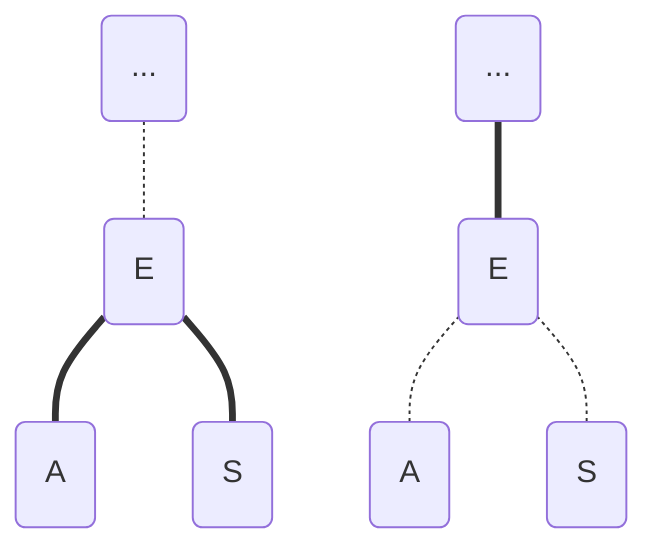
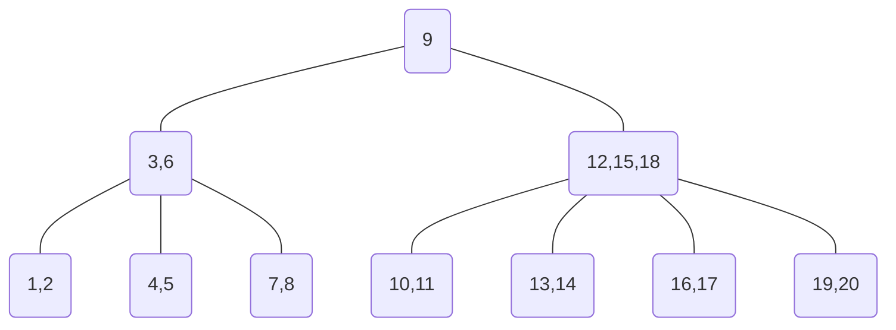

# 1. Data structure

## 1.1 Heap

> The following statement is a quote from [https://github.com/raywenderlich/swift-algorithm-club](https://github.com/raywenderlich/swift-algorithm-club/blob/master/Heap/README.markdown)

A heap is a binary tree inside an array,so it does not use parent/child pointers.A heap is sorted based on the "heap property" that determines the order of the nodes in the tree.

Common use for heap：

*   To build priority queues.
*   To support heap sorts.
*   To compute the minumum (or maximum) element of a collection quickly.

### 1.1.1 The heap property

There are two kinds of heaps: a max-heap and a min-heap. In a max-heap parent nodes have a greater value than each of their children. The property of a min-heap is the oppsite.

> Note：The root of the heap has the maximum or minimum element, but the sort order of other elements are not predictable. For example, the maximum element is always at index 0 in a max-heap, but the minimum element isn’t necessarily the last one. -- the only guarantee you have is that it is one of the leaf nodes, but not which one.

### 1.1.2 The tree inside a array

Implementing a tree-like structure by an array is efficient in both time and space.

There is a well defined relationship between the array index of a tree node and the array indices of its parent and children.

If `i` is the index of a node, then the following formulas give the array indices of its parent and child nodes:

    parent(i) = floor((i - 1)/2)
    left(i) = 2i +1
    right(i) = 2i +2

Note that this scheme has limitations. You can do the following with a regular binary tree but not with a heap.

You can not start a new level unless the current lowest level is completely full, so heaps always have this kind of shape.

### 1.1.3 What can you do with a heap?

There are two primitive operations necessary to make sure the heap is a valid max-heap or min-heap after you insert or remove an element:

*   `shiftUp()`:If The element is greater (in max-heap) or smaller than (in min-heap) than its parent, it need to be swapped with the parent. This makes it move up the tree.
*   `shiftDown`:If the element is smaller (in max-heap) or greater (in min-heap) than its children, it needs to move down the tree. The operation is also called "heapify".

Shifting up or down is a recursive procedure that takes **O(log n)** time.

Here are other operations that are built on primitive operations:

*   `insert(value)`: Adds the new element to the end of the heap and then uses `shiftUp()` to fix the heap.
*   `remove()`:Removes and returns the maximum value (max-heap) or the minimum value (min-heap).

### 1.1.4 Implementation

[Here](https://github.com/janwee-sha/algorithms/blob/main/src/main/java/heap/Heap.java) is my implementation of Heap.

## 1.2 Binary Search Tree

> The following statement is a quote from [Introduction to Algorithms](https://en.wikipedia.org/wiki/Introduction_to_Algorithms).

Serach trees are data structure that support many dynamic-set operations, including SEARCH, MINIMUM, MAXIMUM, PREDECESSOR, SUCCESSOR, INSERT and DELETE. Thus, a search tree can be used both as a dictionary and as a priority queue.

Basic operations on a binary search tree take time proportional to the height of the tree. For a complete binary tree with `n` nodes, such operations run in `O(log n)` worst-case time. If the tree is a linar chain of `n` nodes, however, the same oeprations take `O(n)` worst-case time.

### 1.2.1 What is a binary search tree?

A binary search tree is organized, as the name suggeests, in a binary tree. Such a tree can be represented by a linked data structure in which each node is an object. In additional to a `key` field and satellite data, each node contains fields `left`, `right` and `p` that point to the nodes corresponding to its left child, its right child, and its parent, respectively. If a child or the parent is missing, the appropriate field contains the value `NIL`.

For any node `x`, the keys in the left subtree of `x` are at most `key[x]`, and the keys in the right subtree of `x` are at least `key[x]`.

### 1.2.2 Querying a binary search tree

A common operation performed on a binary search tree is searching for a key stored in the tree. Besides SEARCH operation, BST can support such queries as MAXIMUM, MINIMUM, SUCCESOR, and PREDECESSOR. Each can be suported in time `O(h)` on a binary search tree of height `h`.

### 1.2.3 Insertion and deletion

The operations of insertion and deletion cause the dynamic set represented by a binary search tree to change. The data structure must be modified to reflect this change, but in such a way that the BST property continues to hold.

### 1.2.4 Implementation

Check my implementation of binary search tree in Java [here](https://github.com/janwee-sha/algorithms/blob/main/src/main/java/tree/BST.java).

## 1.3 Two-Three Tree

> 以下描述摘自Robert Sedgewick和Kevin Wayne的《算法（第4版）》

一棵**2-3查找树**或为一棵空树，或由以下结点组成：

*   2- 结点，含有一个键（及其对应的值）和两条链接，左链接指向的2-3树中的键都小于该结点，右链接指向的2-3树中的键都大于该结点。
*   3- 结点，含有两个键（及其对应的值）和三条链接，左链接指向的2-3树中的键都小于该结点，中链接指向的2-3树中的键都位于该结点的两个键之间，右链接指向的2-3树中的键都大于该结点。

一棵**完美平衡**的2-3查找树中的所有空链接到根结点的距离都应该是相同的。

### 1.3.1 Search

2-3树的查找算法可以看作BST的查找算法的一般化。

### 1.3.2 Insertion

向2-3树中插入一个新结点时，我们先对树做一次未命中的查找，然后把新结点挂在树的底部。分为若干种情况：

*   若未命中的查找结束于一个2-结点，只需把这个2-结点替换为一个3-结点，将要插入的键保存在其中即可。

<!---->

    插入K：
            M               M
          /   \           /   \
       (E,J)   R  ->   (E,J)    R
      /   |  \        /   | \
    (A,C) H   L    (A,C)  H (K,L)

*   若未命中的查找结束3-结点，且结点所在的树只有当前结点，我们先把键存入该结点中，使之成为一个4-结点，然后将4-结点分解为3个2-结点组成的2-3树。

<!---->

    插入S :
     (A,E) ->  (A,E,S) ->       E
     / | \     / / \ \        /   \
                             A     S
                            / \   / \

*   若未命中的查找结束于一个父结点为2-结点的3-结点，我们先把键存入该结点，然后将中健移至父结点。

<!---->

    向树中插入Z：
          |                      |                     |
          R                      R                   (R,X)
        /   \        ->        /   \       ->       /  | \
       P   (S,X)              p   (S,X,Z)          p   S   Z
      / \  / | \             / \  / / \ \         / \ / \ / \ 

*   若未命中的查找结束于父结点为3-结点的3-结点，我们一直向上不断分解临时的4-结点并将中键插入更高层的结点。

在一棵大小为N的2-3树中，查找和插入操作访问的结点必然不超过`lg N`个。

## 1.4 Red-Black Tree

> 以下描述摘自Robert Sedgewick和Kevin Wayne的《算法（第4版）》

红黑二叉查找树背后的思想使用标准的二叉查找树和一些额外的信息（替换3-结点）来表示2-3树。将树中的链接分为两种类型：

*   **红链接**，始终左斜的红色链接相连的两个2-结点构成一个3-结点
*   **黑链接**：2-3树中的普通链接。

### 1.4.1 红黑树的属性：

*   红链接均为左链接；
*   没有任何一个结点同时和两条红色链接相连；
*   该树是**完美黑色平衡**的，即任意空链接到根节点的路径上的黑链接数量相同。

### 1.4.2 旋转

（围绕x的）左旋：

          |                |
          x                y
        /   \            /   \
      [A]    y    ->    x    [C]
            / \        / \
          [B] [C]    [A] [B]

（围绕y的右旋）：

          |                |
          x                y
        /   \            /   \
      [A]    y    <-    x    [C]
            / \        / \
          [B] [C]    [A] [B]

### 1.4.3 颜色转换

我们用`FLIP_COLOR`方法来转换一个结点的两个红色子结点的颜色，将子结点的颜色由红变黑，同时将父结点的颜色由黑变红：

> 虚线代表黑链接，实线代表红链接

### 1.4.4 插入

2-3树中的插入算法需要我们分解，将中间腱插入父结点，直至遇到一个2-结点或是根节点。在沿着插入点到根节点的路径向上移动时的情况的对应处理方式：

*   若右子结点是红色而左子结点是黑色的，进行左旋转；
*   若左子结点是红色的且它的左子结点也是红色的，进行右旋转；
*   若左右子结点均为红色，进行颜色转换。

### 1.4.5 实现

[这里](https://github.com/janwee-sha/algorithms/blob/main/src/main/java/tree/RBBST.java)是按以上思想实现的红黑树。

## 1.5 B-Tree

> The following statement is a quote from [Introduction to Algorithms](https://en.wikipedia.org/wiki/Introduction_to_Algorithms) and [https://github.com/raywenderlich/swift-algorithm-club](https://github.com/raywenderlich/swift-algorithm-club/blob/master/Bucket%20Sort/README.markdown).

B-trees are balanced search trees designed to work well on magnetic disks or other direct-access secondary storage devices. B-trees are similar to Red-Black trees, but they are better at minimizing disk I/O operations. Many database systems use B-trees, or variants of B-trees, to store information.

B-trees differ from red-black trees in that B-tree nodes may have many children, from a handful to thousands. That is, the "branching factor" of a B-tree can be quite large, although it is usually determined by characteristics of the disk used. B-trees are similar to red-black trees in that every n-node B-tree has height O(lg n), although the height can be considerably less than that of a red-black tree.

B-trees generalize BST in a natural member.

### 1.5.1 Definition of B-Trees

A **B-Tree** `T` is a rooted tree (whose root is `T.root`) having the following properties:

1.  Every node `x` has the following fields:
    **a**. `x.n`,the number of keys currently stored in node `x`,
    **b**. the `x.n` keys themselves, stored in nondecreasing order, so that `x.key(1)`<=`x.key(2)`<=...<=`x.key(x.n)`,
    **c**. `x.leaf`, a boolean value that is `TRUE` if `x` is a leaf and `FALSE` if `x` is an internal node.
2.  Each internal node `x` also contains `x.n+1` pointers `x.c(1)`, `x.c(2)`,..., `x.c(x.n+1)` to its children. Leaf nodes have no children, so their `c(i)` fields are undefined.
3.  The keys `x.key(i)` separate the ranges of keys stored in each subtree：If `k(i)` is any key stored in the subtree with root `x.c(i)`, then

<!---->

    k(1)<=x.key(1)<=k(2)<=x.key(2)<=...<=x.key(x.n)<=k(x.n+1)

1.  All leaves have the same depth, which is the tree's height `h`.
2.  There are lower and upper bounds on the number of keys a node can contain. These bounds can be expressed in terms of a fixed integer `t>=2` called the **minimum degree** of the B-Tree:
    **a**. Every node other than the root must have at least `t-1` keys. Every internal node other than the root thus has at least `t` children. If the tree is nonempty, the root must have at least one key.
    **b**. Every node can contains at most `2t-1` keys. Therefore, an internal node can have at most `2t` children. We say that a node is **full** if it contains exactly `2t-1` keys.

The simplest B-tree occurs when `t=2`. And in this case, we have a **2-3-4 tree**.

A second order B-Tree with keys from 1 to 20 looks like this:

### 1.5.2 Basic operations on B-trees

**Searching**

Searching a B-tree is much like searching a BST, except that instead of making a binary, or "two-way", branching decision at each node, we make multiway branching decision according to the number of the node's children.

The time complexity of searching a B-tree is `O(t log(t)n)`.

**Insertion**

Keys can only be inserted to leaf nodes.

1.  Perfrom a search for the key `k` we want to insert.
2.  If we haven't found it and we are on a leaf node, we can insert it.

*   If after the search key `l` which we are standing on is greater than `k`: We insert `k` to the position before `l`.
*   Else: We insert `k` after `l`.
    After insertion we should check if the number of keys in the node is in correct range.If not, we need to split the node.

**Spliting a node**

**Removal**

(to be completed)

### 1.5.3 Implementation

[Here](https://github.com/janwee-sha/algorithms/blob/main/src/main/java/tree/BTree.java) is a implementation of B-tree.

# 2. Sorting

## 2.1 Bucket sort

> The following statement is a quote from [https://github.com/raywenderlich/swift-algorithm-club](https://github.com/raywenderlich/swift-algorithm-club/blob/master/Bucket%20Sort/README.markdown)

Bucket sort,also known as Bin Sort,is a distributed sorting algorithm,which sort elements from an array by performing these steps:

1.  Distribute the elements into buckets or bins.
2.  Sort each bucket individually.
3.  Merge the buckets in order to produce a sorted array as the result.

The performance for execution time is:

| Case    | Performance |
| ------- | ----------- |
| Worst   | O(n^2)      |
| Best    | Omega(n+k)  |
| Average | Theta(n+k)  |

> Note: **N** is the number of elements and **K** is the number of buckets.

In the best case, the algorithm distributes the elements uniformly between buckets, a few elements are placed on each bucket and sorting the buckets is O(1). Rearranging the elements is one more run through the initial list.

In the worst case, the elements are sent all to the same bucket, making the process take O(n^2).

## 2.2 Heap Sort

> The following statement is a quote from [https://github.com/raywenderlich/swift-algorithm-club](https://github.com/raywenderlich/swift-algorithm-club/blob/master/Heap%20Sort/README.markdown)

Sorts an array from low to high using a heap.

To sort from lowest to highest, heap sort first converts the unsorted array to a max-heap, so that the first element in the array is the largest.

Let's say the array to sort is:

    [5,13,2,25,7,17,20,8,4]

This is first turned into a max-heap that looks like this:

    [25,13,20,8,7,17,2,5,4]

And then we swap the first element (index `0`) with the last one at index `n-1`, to get:

    [4,13,20,8,7,17,2,5,25]
     *                   *

Now the new root is `4`, will be smaller than its children, so we fix up the max-heap to element `n-2` using the shift down or "heapify" procedure. After that, we get:

    [20,13,17,8,7,4,2,5 | 25]

Again, we swap the first element with the last one (this time at index `n-2`):

    [5,13,17,8,7,4,2,20 | 25]
     *               *

And fix up the heap again:

    [17,13,5,8,7,4,2 | 20,25]

We repeat this process until we arrive at the root node and then the whole array is sorted.

Performance of heap sort is **O(n log n)** in best, worst, and average case.

**Implementation**:

[Here](https://github.com/janwee-sha/algorithms/blob/main/src/main/java/sort/HeapSort.java) is my implementation of Heap Sort.

## 2.3 Quicksort

> The following statement is a quote from [https://github.com/raywenderlich/swift-algorithm-club](https://github.com/raywenderlich/swift-algorithm-club/blob/master/Heap%20Sort/README.markdown) and <https://zhuanlan.zhihu.com/p/269871839>

### 2.3.1 Introduction

Quicksort is one of the most famous algorithms in history. It was invented way back in 1959 by Tony Hoare, at a time when recursion was still a fairly nebulous concept.

Here's how it works. When given an array, the algorithm splits it up into three parts on "pivot" variable. The pivot can be any element of the sorting part of the array.

All the elements less than the pivot go into a partition. All the elements equal to or greater than the pivot go into another partition.

Once we finish to partition, we recursively sort the partitions, then glues those sorted subarrays to get the final result.

### 2.3.2 Implementation

To implement a Quick Sort, we need to consider how to manage the partitions, and put the elements to their correct positions. We can use 4 variables, which can be called `p`,`i`,`j`,`r`. `p` and `r` always mark the start and end position of current subarray. `j` always points at the element to traverse. And `i` marks the end position of the left partition that contains small element. Each time we add an element to the left position, we only need to swap the element `j` and the element `i+1`, then make `i` plus 1. That can help us to achieve the goal of expanding the left partition and the moving the right partition forwards. And when we want to add an element to the right partition, we simply make `j` plus 1.

[Here](https://github.com/janwee-sha/algorithms/blob/main/src/main/java/sort/QuickSort.java) is my implementation of Quick Sort.

# 3. Classic Cases

## 3.1 K-th Largest Element Problem

Given an integer array `a`. Write an algorithm that finds the k-th largest element in the array.

Here's a solution:

> 作者：LeetCode-Solution
> 链接：<https://leetcode.cn/problems/kth-largest-element-in-an-array/solution/shu-zu-zhong-de-di-kge-zui-da-yuan-su-by-leetcode-/>
> 来源：力扣（LeetCode）

我们可以用快速排序来解决这个问题，先对原数组排序，再返回倒数第 `k` 个位置，这样平均时间复杂度是 `O(n log n)`O，但其实我们可以做的更快。

首先我们来回顾一下快速排序，这是一个典型的分治算法。我们对数组 `a[l⋯r]` 做快速排序的过程是（参考《算法导论》）：

*   分解： 将数组 `a[l⋯r]`「划分」成两个子数组 `a[1...q-1]`、`a[q+1...r]`，使得`a[1...q-1]`中的元素小于等于`a[q]`，且 `a[q]`小于等于 `a[q+1⋯r]` 中的每个元素。其中，计算下标 `q` 也是「划分」过程的一部分。
*   解决： 通过递归调用快速排序，对子数组 `a[l⋯q−1]` 和`a[q+1⋯r] `进行排序。
*   合并： 因为子数组都是原址排序的，所以不需要进行合并操作，`a[l⋯r]` 已经有序。
    上文中提到的 「划分」 过程是：从子数组 `a[l⋯r]` 中选择任意一个元素 `x` 作为主元，调整子数组的元素使得左边的元素都小于等于它，右边的元素都大于等于它， `x` 的最终位置就是 `q`。
    由此可以发现每次经过「划分」操作后，我们一定可以确定一个元素的最终位置，即 `x` 的最终位置为 qq，并且保证 `a[l⋯q−1]` 中的每个元素小于等于 `a[q]`，且 `a[q]` 小于等于 `a[q+1⋯r]` 中的每个元素。所以只要某次划分的 `q` 为倒数第 `k` 个下标的时候，我们就已经找到了答案。 我们只关心这一点，至于 `a[l⋯q−1]` 和 `a[q+1⋯r] `是否是有序的，我们不关心。

因此我们可以改进快速排序算法来解决这个问题：在分解的过程当中，我们会对子数组进行划分，如果划分得到的 `q` 正好就是我们需要的下标，就直接返回 `a[q]`；否则，如果 `q` 比目标下标小，就递归右子区间，否则递归左子区间。这样就可以把原来递归两个区间变成只递归一个区间，提高了时间效率。这就是「快速选择」算法。

我们知道快速排序的性能和「划分」出的子数组的长度密切相关。直观地理解如果每次规模为 `n` 的问题我们都划分成 1 和 `n−1`，每次递归的时候又向 `n−1` 的集合中递归，这种情况是最坏的，时间代价是 `O(n^2`
)。我们可以引入随机化来加速这个过程，它的时间代价的期望是`O(n)`，证明过程可以参考「《算法导论》9.2：期望为线性的选择算法」。

[这里](https://github.com/janwee-sha/algorithms/blob/main/src/main/java/cases/KthLargestElement.java) 是按以上思路实现的代码。
