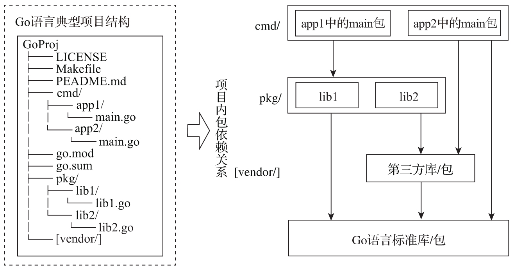

# 3. 理解Go语言的设计哲学

## 3.1 追求简单

- 简洁、常规的语法，它仅有25个关键字
- 内置垃圾收集
- 没有头文件
- 显式依赖
- 没有循环依赖
- 常量只是数字
- 首字母大小写决定可见性
- 任何类型都可以拥有方法
- 没有子类型继承
- 没有算法转换
- 接口是隐式的
- 方法就是函数
- 接口只是方法集合
- 方法仅按名称匹配（不是按类型）
- 没有构造函数或析构函数
- `n++` 、`n--`是语句而非表达式
- 没有`++n`、`--n`
- 赋值不是表达式
- 在赋值和函数调用中定义的求值顺序
- 没有指针算术
- 内存总是初始化为零值
- 没有类型注解语法
- 没有模板/泛型
- 没有异常
- 内置字符串、切片（slice）、map类型
- 内置数组边界检查
- 内置并发支持
...

## 3.2 偏好组合，正交解耦

Go语言中没有经典的OO的语法元素、类型体系和继承机制。

Go语言遵从的设计哲学是组合。

语言设计层面，Go提供了正交的语法元素供后续组合使用，包括：

- Go语言无类型体系，类型间是独立的，没有子类型的概念；
- 每个类型都可以有自己的方法集合，类型定义与方法实现是正交独立的；
- 接口与其实现之间隐式关联；
- 包之间是相对独立的，没有子包的概念。

## 3.3 原生并发，轻量高效

Go语言原生支持并发的设计哲学体现在以下几个方面：

- 采用轻量级协程并发模型，使得Go应用在面向多核硬件时更具可扩展性；
- 为开发者提供的支持并发的语法元素和机制；
- 并发原则对Go开发者在程序结构设计层面的影响。

## 3.4 面向工程，自带“电池”

对于如何解决工程领域规模化所带来的问题：

- 面向工程的语言设计。
- 丰富的标准库。

# 5. 使用得到公认且广泛使用的项目结构

## 5.2 Go语言典型项目结构

非官方标准的建议结构布局：

1. 以构建二进制可执行文件为目的的Go项目结构

各个重要目录的用途：

- cmd目录：存放项目要构建的可执行文件对应的main包的源文件。
- pkg目录：存放项目自身要使用并且同样也是可执行文件对应main包要依赖的库文件。
- Makefile：项目构建工具所使用脚本的“代表”，它可以代表任何第三方构建工具所用的脚本。Go并没有内置如make、bazel等级别的项目构建工具。
- go.mod和go.sum：Go语言包依赖管理使用的配置文件。Go 1.11版本引入Go module机制，Go 1.16版本中，Go module成为默认的依赖包管理和构建机制。
- vendor目录（可选）：Go 1.5版本引入的用于在项目本地缓存特定版本依赖包的机制。