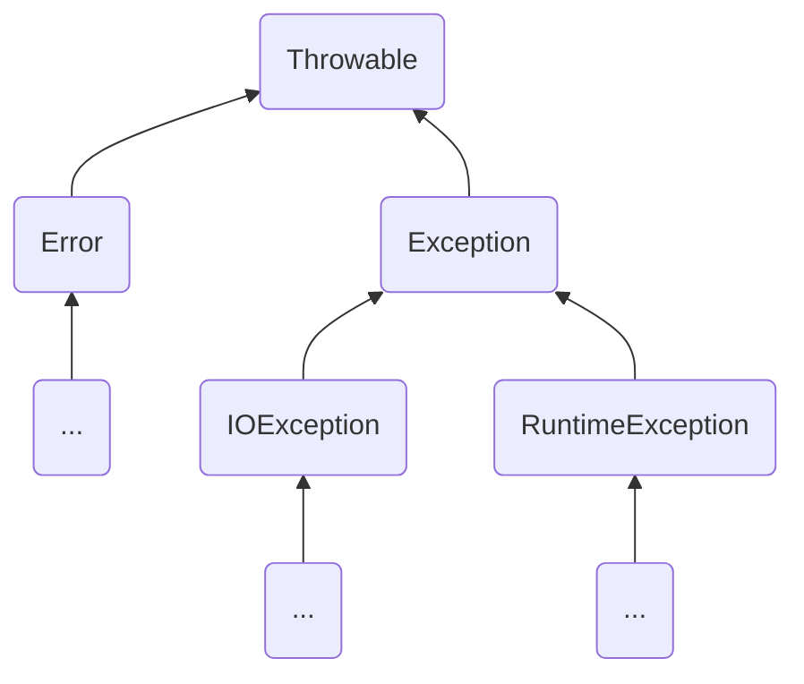
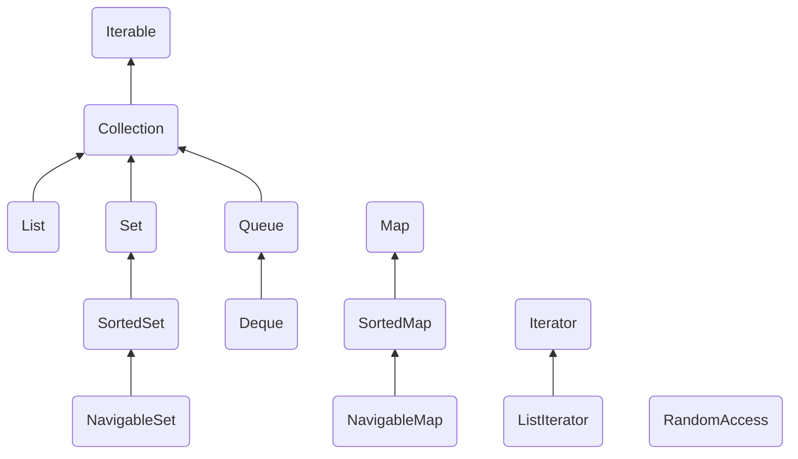
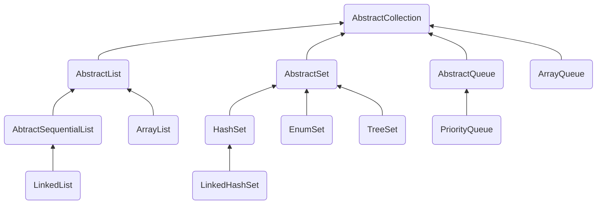
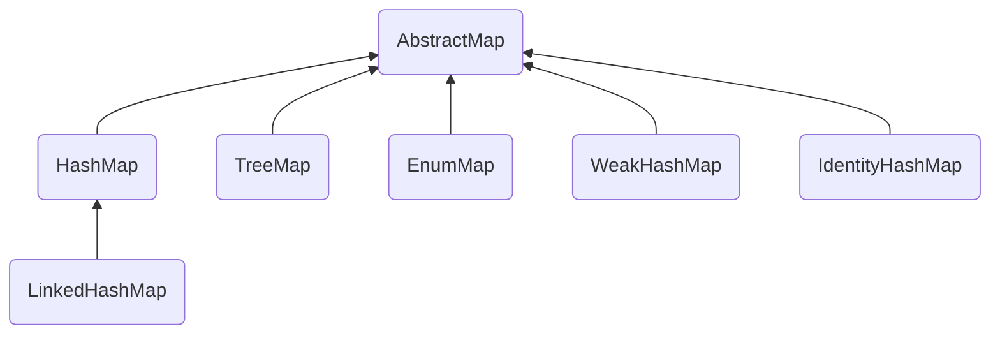
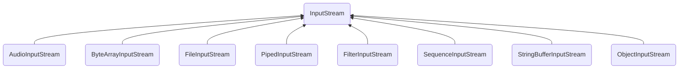
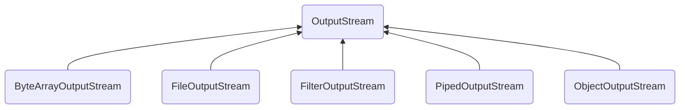
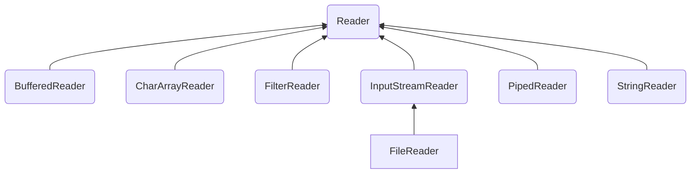
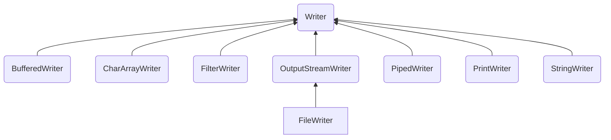

> The following statments are some reading notes of Cay S. Horstman's [Core Java](https://horstmann.com/corejava/) (10th Edition) 

# Volume I

## Chapter 7 Exceptions, Assertions, and Logging

### 7.1 Dealing with Errors

程序中可能出现的错误：

- 用户输入错误
- 设备错误
- 物理限制
- 代码错误

在Java中，若某方法不能够采用正常的途径完成它的任务，就可以通过另外一个路径退出。在这种情况下，方法并不返回任何值，而是抛出一个封装了错误信息的对象。调用此方法的代码也将无法继续执行，取而代之的是，异常处理机制开始搜索能够处理郑重异常情况的异常处理器。

#### 7.1.1 Catching Exceptions

Java程序中的异常对象都是派生于 `Throwable` 类的一个实例。

Java异常层次结构的一个简化示意图：




Error类层次结构描述了Java运行时系统的内部错误和资源耗尽错误。应用程序不应该抛出这种类型的异常。若出现了这样的内部错误，除了通告给用户，并尽力使程序安全地终止之外，再也无能为力了。

Exception类层次结构使设计Java程序时需要关注的。Exception下的两个分支：

- RuntimeException：程序错误导致的异常。
- 其他异常：程序本身没有问题，但由于像I/O错误这类问题导致的异常。

Java语言规范将派生于Error类或RUntimeException类的所有异常称为非受查（unchecked）异常，所有其他异常称为受查（checked）异常。

#### 7.2.4 The *finally* Clause

不管是否有异常被捕获，`finally` 子句都被执行。

try语句可以只有 `finally` 子句，而没有 `catch`子句。

解耦 `try/catch` 和 `try/finally` 语句块的写法：

```
try {
    try {
        code that might throw exceptions
    } finally {
        close resources
    }
} catch (Exception e) {
    show error message
}
```

### 7.3 Tips for Using Exceptions

1. 异常处理不能代替简单的测试
2. 不要过分地细化异常
3. 利用异常层次结构

    不要只抛出异常父类，应该寻找更加适当的子类或创建自己的异常类。
    不要只捕获Throwable异常，否则会使代码更难读、更难维护。
    
4. 不要压制异常
5. 在检测错误时，苛刻比放任更好
6. 不要羞于传递异常

## 9 Collections

### 9.1 The Java Collections Framework

#### 9.1.1 Separating Collection Interfaces and Implementation

队列通常有两种实现方式：一种是使用循环数组；另一种是使用链表。

循环数组要比链表更高效，因此多数人优先选择循环数组。

循环数组是一个有界集合，即容量有限。如果程序中要收集的对象数量没有上限，就最好使用链表来实现。

#### 9.1.3 Iterators

用“for each”循环可以更加简练地表示同样地循环操作。编译器简单地将“for each”循环翻译为带有迭代器的循环。

“for each”循环可以与任何实现了Iterable接口的对象一起工作，这个接口只包含`Iterator<E> iterator();`一个抽象方法。

在Java SE 8中，甚至不用写循环。可以调用 `forEachRemaining` 方法。

Iterator接口的 `remove` 方法将会删除上次调用 `next` 方法时返回的元素。若想要删除指定位置上的元素，仍然需要越过这个元素。如，删除集合中第一个元素的方法：

```
Iterator<Integer> it = nums.iterator();
it.next();//skip over the first element
it.remove;//now remove it
```

对 `next` 方法和 `remove` 方法的调用具有互相依赖性。若调用 `remove` 前没有调用 `next` 将是不合法的。这样做会抛出一个 `IllegalStateException` 异常。

#### 9.1.5 Interfaces in the Collections Framework



集合有两个基本接口：`Collection` 和 `Map`。

`List` 是一个有序集合（ordered collection）。元素会增加到容器中的特定位置。可以采用两种方式访问元素：使用迭代器访问，或者使用一个整数索引来访问。后者称为任意访问（random access），因为这样可以按任意顺序访问元素。前者须顺序访问。

List接口定义了很多用于随机访问的方法：

```
void add(int index, E element);
void remove(int index);
E get(int index);
E set(int index, E element);
```

ListIterator是Iterator的一个子接口，它定义了一个方法用于在迭代器位置前面增加一个元素：

```
void add(E element);
```

实际中有两种有序集合，其性能开销有很大差异。由数组支持的有序集合可以快速地随机访问，因此适合使用List方法并提供一个整数索引来访问。与之不同，链表尽管也是有序的，但是随机访问很慢，所以最好使用迭代器来遍历。如果原先提供两个接口就会容易一些了。

> 注释：为了避免对链表完成随机访问操作，Java SE 1.4引入了一个标记接口RandomAccess。这个接口不包含任何方法，不过可以用它来测试一个特定的集合是否支持高效的随机访问。

[这里](https://github.com/janwee-sha/java-in-practice/blob/main/src/main/java/collection/Iteration.java)的代码示例展示基于数组实现的有序集合和基于链表实现的有序集合的随机访问和顺序访问对比。

Set接口等同于Collection接口，不过其方法的行为有更严谨的定义。集（Set）的add方法不允许增加重复的元素。要适当地定义集地equals方法，只要两个集包含同样地元素就认为是相等地，而不要求这些元素有同样的顺序。hashCode方法的定义要保证包含相同元素的两个集会得到相同的散列码。

[这里](https://github.com/janwee-sha/java-in-practice/blob/main/src/main/java/container/SetFeatures.java)的代码示例表明Set不允许增加重复的元素。

SortedSet和SortedMap接口会提供用于排序的比较器对象，这两个接口定义了可以得到集合子集视图的方法。

Java SE 6引入了接口NavigableSet和NavigableMap，其中包含一些用于搜索和遍历有序集和映射的方法。（理想情况下，这些方法本应当直接包含在SortedSet和SortedMap接口中。）TreeSet和TreeMap类实现了这些接口。

### 9.2 Concrete Collections

Java库中的具体集合：

- ArrayList：一种可以动态增长和缩减的索引序列。
- LinkedList：一种可以在任何位置进行高效地插入和删除操作的有序序列。
- ArrayDeque：一种用循环数组实现的双端队列。
- HashSet：一种没有重复元素的无序集合。
- TreeSet：一种有序集。
- EnumSet：一种包含枚举类型值的集。
- LinkedHashSet：一种可以记住元素插入次序的集。
- PriorityQueue：一种允许高效删除最小元素的集合。
- HashMap：一种存储键/值关联的数据结构。
- TreeMap：一种键值有序排列的映射表。
- LinkedHashMap：一种可以记住键/值项添加次序的映射表。
- WeakHashMap：一种其值无用后可以呗垃圾回收器回收的映射表。
- IdentityHashMap：一种用==而不是用equals比较键值的映射表。




#### 9.2.1 Linked Lists

There's an important difference between linked lists and generic collections.A linked list is an ordered collection in which the position of the objects matters.The `LinkedList.add` method adds the object to the end of the list. The position-dependent `add` method is the responsibility of an iterator,since iterators describe positions in collections.Using iterator to add elements makes sense only for collections that have a natural ordering.Therefore,there is no `add` method in the `Iterator` interface.Intead,the collection library supplies a subinterface `ListIterator` that contains an `add` method.

In addition,the `ListIterator` interface has two methods that you can use for traversing a list backwards.

```
E privious();
boolean hasPrivious();
```

If you just called `privious`,the element to the right will be removed after calling `remove`.

Unlike the `add` method,which depends on the iterator position, the `remove` method depends on the iterator state.

If a iterator traverses a collection while another iterator is modifying it,it will throws a `ConcurrentModificationException`.

#### 9.2.3 Hash Sets

A well-known data structure for finding objects quickly is the *hash table*. A hash table computes an integer, called the *hash code*, for each object. A hash code is somehow derived from the instance fields of an object, preferably in such a way that obects with different data yield different codes.

In Java, hash tables are implemented as arrays of linked lists. Each list is called a *bucket*. To find the place of an object in the table, compute its hash code and reduce it modulo the total amount of buckets. The result number is the index of the bucket that holds the element. Sometimes, you will hit a bucket that is already filled. This is called a *hash collision*. Then compare the new object with all objects in that bucket to see if it is already present. If the hash code are reasonably randomly distributed and the number of buckets is large enough, only a few comparisons should be nessary.

> As of Java SE 8, the buckets change from linked lists into balanced binary trees (Red-black trees) when they get full. This improves performance if a hash function was poorly chosen and yields many collisions, or if malicious code tries to flood a hash table with many values that have identical hash codes.

Typically, you should set the initial bucket count to somewhere between 75% and 150% of the excepted element count. The standard libary uses bucket counts that are power of 2, with a default of 16. (Any value you supply for the table size is automatically rounded to the next power of 2.)

If the hash table gets too full, it needs to be *rehashed*. To rehash the table, a table with more buckets is created, all the elements are inserted to the new table, and the original table is discarded. The *load factor* determines when a hash table is rehashed.

### 9.2.4 Tree Sets

The *TreeSet* class is similar to the hash set, with one added improvement. A tree set is *sorted collection*.

The sorting of a tree set is accomplished by a tree data structure.(The current implementation uses a *red-black tree*).

Adding a element to a tree is slower than adding it to a hash table. But it is still much faster than checking for duplicate in an array or linked list. 


| API: java.util.NavigableSet<E> 6 |
| --- |
| \* E higher (E value)<br>\* E lower (E value)<br>returns the least *element* > *value* or the largest *element* < *value*, or null if there is no such element. |
| \* E ceiling (E value)<br>\* E floor (E value)<br>returns the least *element* >= *value* or the largest *element* <= *value*, or null if there is no such element. |
| \* Iterator<E> descendingIterator()<br>return an iterator that traverses this set in descending direction|

[Here](https://github.com/janwee-sha/java-in-practice/blob/main/src/main/java/collection/test/TreeSetTest.java) are some codes that test a tree set.

## 14 Concurrency

多线程程序在较低的层次上扩展了多任务的概念：一个程序同时执行多个任务。

多线程与多进程的本质区别在于每个进程拥有自己的一整套变量，而线程则共享数据。共享变量使线程之间的通信比进程之间的通信更有效、更容易。此外，在有些操作系统中，与进程比较，线程更“轻量级”，创建、撤销线程的开销比进程要小得多。

### 14.1 What are Threads

直接调用Thread类或Runnable对象的run方法，只会执行同一个线程中的任务，而不会启动新线程。调用Thread.start方法将创建一个执行run方法的新线程。

### 14.2 Interrupting Threads

Java早期版本中的Thread.stop方法可以用来终止线程，但该方法现在已经被弃用了。

当对一个线程调用interrupt方法时，线程的中断状态将被置位。每个线程都应该不时地检查这个标志，以判断线程是否被中断。

使用isInterrupted方法判断一个线程是否被置位。

被阻塞的线程就无法检测中断状态。当在一个被阻塞的线程上调用interrupt方法时，阻塞调用将会被Interrupted Exception异常中断。

没有任何语言方面的需求要求一个被中断的线程应该终止。中断一个线程不过是引起它的注意。被中断的线程可以决定如何响应中断。线程简单地将中断作为一个终止请求时run方法具有如下形式：

```
Runnable r = () -> {
    try {
        ...
        while(!Thread.currentThread().isInterrupted() && more work to do) {
            do more work
        } catch (InterruptedException e) {
            //thread was interrupted during sleep or wait
        } finally {
            clean up if nessary
        }
        //exiting the run method terminates the thread
    }
};
```

如果中断状态被置位时调用sleep方法不会休眠线程，相反，它将清楚这一状态并抛出InterruptedException。

interrupted是一个静态方法，它检测当前的线程是否被中断并清除该线程的中断状态；isInterrupted是一个实例方法，可用来检测线程是否被中断且不会改变中断状态。

### 14.3 Thread States

线程可以有以下6种状态：

- New（新创建）
- Runnable（可运行）
- Blocked（阻塞）
- Waiting（等待）
- Timed waiting（计时等待）
- Terminated（被终止）

#### 14.3.1 New Threads

当用new操作符创建一个新线程时，该线程还没有开始运行，此时线程处于新创建状态。

#### 14.3.2 Runnable Threads

一旦调用start方法，线程处于runnable状态。一个可运行的线程可能正在云南行也可能没有运行，这取决于操作系统给线程提供运行的时间。

一旦一个线程开始运行，它不必始终保持运行。抢占式调度系统给每一个可运行线程一个时间片来执行任务。

现在所有的桌面以及服务器操作系统都是用抢占式调度。但是，像手机这样的小型设备可能使用协作式调度。在这样的设备中，一个线程只有在调用yield方法，或者被阻塞或等待时，线程才失去控制权。

#### 14.3.3 Blocked and Waiting Threads

当线程处于被阻塞或等待状态时，它暂时不活动。它不运行任何且消耗最少的资源。

- 当一个线程试图获取一个内部的对象锁（而不是java.util.concurrent库中的锁），而该锁被其他线程持有，则该线程进入阻塞状态。当所有其他线程释放该锁，并且线程调度器允许本线程持有它的时候，该线程将编程非阻塞状态。
- 当线程等待另一个线程通知调度器一个条件时，它自己进入等待状态。在调用Object.wait方法或Thread.join方法，或者是等待java.util.concurrent库中的Lock或Condition时，就会出现这种情况。实际上，被阻塞状态与等待状态是有很大不同的。
- 有几个方法有一个超时参数。调用它们导致线程进入计时等待（timed waiting）状态。这一状态将一直保持到超时期满或者接收适当的通知。

#### 14.3.4 Terminated Threads

线程被终止有两个原因：

- 因为run方法正常退出而死亡。
- 因为一个没有捕获的异常终止了run方法而意外死亡。

void join()
等待终止指定的线程。

void join(long millis)
等待指定的线程死亡或者经过指定的毫秒数。

Thread.join方法和wait方法、notify方法一起，用于实现Java线程间的同步机制。

#### 14.4.2 Daemon Threads

可以通过调用`Thread.setDaemon(true)`将线程转换为守护线程。当 JVM 中不存在任何一个正在运行的非守护线程时，则 JVM 进程即会退出。守护线程的唯一用途是为其他线程提供服务。

#### 14.4.3 Handlers for Uncaught Exceptions

（待读）

### 14.5 Synchronization

通常两个或两个以上的线程需要共享对同一数据的存取。如果两个线程存取相同的对象，并且每一个线程都调用了一个修改对象状态的方法，此时根据线程访问数据的次序，可能会产生讹误的对象。这样一种情况通常称为竞争条件。

####  14.5.3 Lock Objects

有两种机制防止代码块受并发访问的干扰。Java语言提供一个synchronized关键字达到这一目的，并且Java SE 5.0引入了ReentrantLock类。synchronized关键字自动提供了一个锁以及相关的“条件”，对于大多数需要显式锁的情况，这是很便利的。

锁是可重入的，因为线程可以重复地获得已经持有的锁。锁保持一个持有计数（hold count）来跟踪对lock方法的嵌套调用。

ReentrantLock()
构造一个可以用来被保护临界区的可重入锁。

ReentrantLock(boolean fair)
构造一个带有公平策略的锁。一个公平锁偏爱等待时间最长的线程，但是会大大降低性能。

#### 14.5.4 Condition Objects

通常，线程进入临界区，却发现在某一条件满足之后它才能执行。要使用一个条件对象来管理哪些已经获得了一个锁但是却不能做有用工作的线程。

等待获得锁的线程和调用await方法的线程存在本质上的不同。

一旦一个线程调用await方法，它进入该条件的等待集。当锁可用时，该线程不能马上解除阻塞。相反，它处于阻塞状态，直到另一个线程调用同一条件上的signalAll方法时为止。

通常，对await的调用应该再如下形式的循环体中：

```
while(!(ok to proceed))
    condition.await();
```

另一个方法signal，则是随机接触等待集中某个线程的阻塞状态。这比接触所有线程的阻塞更加有效，但也存在死锁的危险。

#### 14.5.5 The *synchronized* Keyword

锁和条件的关键之处：

- 锁用来保护代码片段，任何时刻只能有一个线程执行被保护的代码。
- 锁可以管理试图进入被保护代码段的线程。
- 锁可以拥有一个或多个相关的条件对象。
- 每个条件对象管理那些已经进入被保护的代码段但还不能运行的线程。

Lock和Condition接口为程序设计人员提供了高度的锁定控制。然而，大多数情况并不需要那样的控制，并且可以使用一种嵌入到Java语言内部的机制。从1.0版开始，Java中的每一个对象都有一个内部锁。如果一个方法用synchronized关键字声明，那么对象锁将保护整个方法。也就是说，线程要调用该方法就必须获得内部的对象锁。

内部对象锁只有一个相关条件。wait方法添加一个线程到等待集中，notifyAll/notify方法解除等待线程的阻塞状态。

将静态方法声明为synchronized也是合法的。如果调用这种方法，该方法获得相关的类对象的内部锁。

内部锁和条件存在一些局限。包括：

- 不能中断一个正在试图获得锁的线程。
- 试图获得锁时不能设定超时。
- 每个锁仅有单一的条件，可能是不够的。

使用一个对象的锁来实现额外的原子操作，实际上称为客户端锁定（client-side locking）。

**截获锁**

对于拥有同步方法的类，如Vector，我们可以截获它的锁：

```
public void transfer(Vector<Double> accounts,int from,int to,int amount) {
    synchronized (accounts) {
        accounts.set(from, accounts.get(from) - amount);
        accounts.set(to, accounts.get(to) + amount);
    }
}
```

这个方法可以工作，但是它完全依赖于类对自己的所有可修改方法都使用内部锁。

因此，客户端锁定是非常脆弱的，通常不推荐使用。

#### 14.5.7 The Monitor Concept

锁和条件是线程同步的强大工具，但严格地说并不是面向对象的。研究人员努力寻找一种方法，可以在不需要程序员考虑如何加锁的情况下，就可以保证多线程的安全性。最成功的解决方案之一是监视器（monitor）。

用Java的术语，监视器具有如下的特性：

- 监视器只包含私有域的类。
- 每个监视器的对象有一个相关的锁。
- 使用该锁对所有方法进行加锁。即，若客户端调用obj.method()，那么obj对象的锁是在方法调用开始时自动获得，且当方法返回时自动释放该锁。因为所有的域是私有的，这样的安排可以确保一个线程在对对象操作时，没有其他线程能访问该域。
- 该锁可以有任意多个相关条件。

监视器的早期版本只有单一的条件，使用一种很优雅的句法。可以简单地调用await accounts[from]>=balance而不是用任何显式的条件变量。然而，研究表明盲目地重新测试条件是低效的。显式的条件变量解决了这一问题。每一个条件变量管理一个独立的线程集。

Java设计者以不是很精确的方式采用了监视器概念，Java中的每一个对象有一个内部的锁和内部的条件。如果一个方法用synchronized关键字声明，那么，它表现得就像是一个监视器方法。通过调用wait/notifyAll/notify来访问条件变量。

Java对象有3个方面不同于监视器，从而使得线程的安全性下降：

- 域不要求必须是private。
- 方法不要求必须是synchronized。
- 内部锁对客户是可用的。

#### 14.5.8 Volatile Fields

- 多处理器的计算机能够暂时在寄存器或本地缓冲区保存内存中的值。结果是，运行在不同处理器上的线程可能在同一个内存位置取到不同的值。
- 编译器可以改变指令执行的顺序以使吞吐量最大化。这种顺序上的变化不会改变代码语义，但是编译器假定内存的值仅仅在代码中有显式的修改指令时才会改变。然而，内存的值可以被另一个线程改变！

> Brian Goetz：如果向一个变量写入值，而这个变量接下来可能会被另一个线程读取，或者，从一个变量读值，而这个变量可能是之前被另一个线程写入的，此时必须使用同步。

volatile关键字为实例域的同步访问提供了一种免锁机制。如果声明一个域为volatile，那么编译器和虚拟机就知道该域是可能被一个线程并发更新的。

**非原子的64位操作**

非volatile的long、double变量即使不考虑失效数据问题，在多线程中使用共享且可变操作也是不安全的。

volatile是一种稍弱的同步机制，用以确保将变量的更新操作通知到其他线程。

加锁机制可同时保证可见性、原子性，volatile变量只能确保可见性。

volatile保证同步的例子：

```
private volatile boolean done;

public boolean isDone() {return done};

public boolean setDone(boolean done) {this.done = done;}
```

*注：Volatile变量不能提供原子性。例如：*

```
public void flipDone() {done=!done;}
```
*不能确保翻转域中的值。*

#### 14.5.12 Thread-Local Variables

线程间共享变量存在风险。有时可能要避免共享变量，使用ThreadLocal辅助类为各个线程提供各自的实例。

ThreadLocal叫做线程变量，该变量对其他线程而言是隔离的，亦即该变量是当前线程独有的变量。ThreadLocal为变量在每个线程都创建了一个副本。

ThreadLocal提供了线程本地的实例。它与普通变量的区别在于，每个使用该变量的线程都会初始化一个完全独立的副本。ThreadLocal变量通常被private static修饰。当一个线程结束时，它所使用的说有ThreadLocal对应的实例副本都可被回收。

ThreadLocal与synchronized的区别在于，synchronized用于线程间的数据共享，而ThreadLocal用于线程间的数据隔离。

#### 14.5.14 Read/Write Locks

java.util.concurrent.locks包定义了两个锁类，ReentrantLock类和ReentrantLockWriteLock类。如果很多线程从一个数据结构读取数据而很少线程修改其中数据的话，后者是十分有用的。


#### 14.5.15 Why the *stop* and *suspend* Methods Are Deprecated

stop和suspend都有一些共同点：都试图控制一个给定线程的行为。

stop方法终止所有未结束的方法，包括run方法。当线程被终止，立即释放被它所著的所有对象的锁。这会导致对象处于不一致的状态。

当线程要终止另一个线程时，无法知道什么时候调用stop方法是安全的，什么时候导致对象被破坏。

如果suspend挂起一个持有一个锁的线程，那么，该锁在恢复之前是不可用的。如果调用suspend方法的线程试图获取同一个锁，那么程序死锁：被挂起的线程等着被恢复，而将其挂起的线程等待恢复锁。

### 14.6 Blocking Queues

当试图向队列添加元素而队列已满，或是想从队列移出元素而队列为空的时候，阻塞队列（blocking queue）导致线程阻塞。在协调多个线程之间的合作时，阻塞队列是一个有用的工具。工作者线程可以周期性地将中间结果存储在阻塞队列中。其他工作者线程移出结果并进一步加以修改。队列会自动地平衡负载。若第一个线程集运行得比第二个慢，第二个线程集在等待结果时会阻塞。若第二个线程集运行得快，它将等待第二个队列集赶上来。

阻塞队列方法：


| 方法 | 正常动作 | 特殊情况下的动作 |
| --- | --- | --- |
| add | 添加一个元素 | 若队列满，抛出IllegalStateException |
| element | 返回头元素 | 若队列空，抛出NoSuchElementException |
| remove | 移出并返回头元素 | 若队列空，抛出NoSuchElementException |
| offer | 添加一个元素并返回true | 若队列慢，返回false |
| peek | 返回头元素 | 若队列空，返回null |
| poll | 移出并返回头元素 | 若队列空，返回null |
| put | 添加一个元素 | 若队列满，则阻塞 |
| take | 移出并返回头元素 | 若队列空，则阻塞 |

阻塞队列的方法按响应方式分为3类。若将队列作线程管理工具用，将要用到put、take方法。

*poll和peek方法返回null来指示失败。因此，向这些队列中插入null值是非法的。*

阻塞队列的变种：

- LinkedBlockingQueue，容量是没有上边界的，但可指定最大容量。
- LinkedBlockingDeque：前者的双端版本。
- ArrayBlockingQueue：在构造时需要指定容量，且有一个可选的参数来指定是否需要公平性。若设置了公平性，等待时间最长线程会优先得到处理。
- PriorityBlockingQueue：是一个带优先级的队列，而不是先进先出队列。该队列没有容量上限，取元素的操作会阻塞。
- DelayQueue：包含了实现Delayed接口的对象。

### 14.7 Thread-Saft Collections

（待读）

### 14.8 Callables and Futures

Callable：

```
interface Callable<V> {
    V call() throws Exception;
}
```

Future:

```
interface Future<V> {
    V get() throws ...;
    V get(long timeout, TimeUnit unit) throws ...;
    void cancel(boolean mayInterrupt);
    boolean isCancelled();
    boolean isDone();
}
```

第一个get方法调用被阻塞，直到计算完成。如果在计算完成之前，第二个get方法的调用超时，抛出一个TimeoutException异常。若运行线程被中断，两者都将抛出InterruptedException。若计算已完成，则返回true。

若计算还在进行，isDone返回false；否则返回true。

可用cancel方法取消该计算。若计算还未开始，它被取消且不再开始。若计算运行中，那么如果mayInterrupt参数为true，它就被中断。

FutureTask包装器是一种非常便利的机制，可将Callable转换成Future和Runnable，它同时实现二者的接口。

# Volume II

## Chapter 1. Streams

Streams provide a view of data that lets you specify computations at a higher conceptual level than with collections. With a stream, yoou specify what you want to have done, not how to do it. You leave the schduling of operations to the implementation.

### 1.1 From Iterating to Stream Operations

> #### java.util.stream.Stream 8
>
> - **static <T> Stream<T> of(T... values)**
> yields a stream whose elements are the given values.
>
> - **static <T> Stream<T> empty()**
> yields a stream with no elements.
>
> - **static <T> Stream<T> generate(Supplier<T> s)**
> yields an infinite stream whose elements are constructured by repeatedly invoking the function a.
>
> - **static <T> Stream<T> iterate(T seed, UnaryOperator<T> f)**
> - **static <T> Stream<T> iterate(T seed, Predicate<? super T> hasNect, UnaryOperator<T> f)**
> yields a stream whose elements are `seed`, `f` invoked on the proceding element, and so on. The first method yields an infinite stream. The stream of the second method comes to an end before the first element that doesn't fulfill the `hasNext` predicate.

> #### java.util.Spliterators 8
> - static <T> Spliterator<T> spliteratorUnknownSize(Iterator<? extends T> iterator, int characteristics)
> turn an iterator into a splittable iterator of unknown size with the give characteristics (a bit pattern containing contants such as `Spliterator.ORDERED`).

> #### java.util.Arrays 1.2
> - static <T> Stream<T> stream(T[], int startInclusive, int endExclusive)
yields a stream whose elements are the specified range of the array.

> #### java.util.regex.Pattern 1.4
> - Stream<String> splitAsStream(CharSequence input) 8
> yields a stream whose elements are the parts of the input that are delimited by this pattern.

> #### java.nio.file.Files 7
> - static Stream<String> lines(Path path) 8
> - static Stream<String> lines(Path path, Charset cs)8
> yields a stream whose elements are the lines of the specified file, with the UTF-8 charset or the given charset.


## Chapter 2. Input and Output

### 2.1 Input/Output Streams

In the Java API, an object from which we can read a sequence of bytes is called an *input stream*. An object to which we can write a sequence of bytes is called an *output stream*. These resources and destinations of bytes can be files, network connections and even blocks of memory. The abstract classes `InputStream` and `OutputStream` forms the basis for a hierachy of input/output classes. Byte-oriented I/O streams are inconvenient for processing information stored in Unicode (Unicode uses multiple bytes per character). Therefore, a separate hierarchy provides classes for processing Unicode characters that inhert from the abstract `Reader` and `Writer` classes. These classes have read and write operations that based on two-byte `char` values (that is, UTF-16 code units) rather than `byte` values.

#### 2.1.1 Reading and Writing Bytes

The `Inputstream` class has an abstract method:

```
abstract int read()
```

This method reads one byte and return the byte that was read, or `-1` if it encounters the end of the input source. 

Since Java 9, there is a very useful method to read all bytes of a stream:

```
byte[] bytes = in.readAllBytes();
```

When you have finished reading or writing to an input/output stream, close it by calling `close` method.

[Here](https://github.com/janwee-sha/java-in-practice/blob/main/src/main/java/io/test/InOutStreamTest.java) are a test unit that test the `read` method of `InputStream` and `write` method of `OutputStream`. 

#### 2.1.2 The Complete Stream Zoo









As you saw, the `InputStream` and `OutputStream` classes let you read and write individual bytes and arrays of bytes.

For Unicode text, on the other hand, you can use subclasses of the abstract classes `Reader` and `Writer`.

There are four additional interfaces: `Closeable`,`Flushable`,`Readable`, and `Appendable`.

`Closeable` has the method

```
void close() throws IOException
```

The classes `InputStream`, `OutputStream`, `Reader`, and `Writer` all implement the `Closeable` interface.

`Flushable` has the method

```
void flush()
```

`OutputStream` and `Writer` implement the interface.

The `Readable` interface has a single method

```
int read(CharBuffer cb) 
```

The `CharBuffer` class has methods for sequential and random read/write access. It represents an in-memory buffer or a memory-mapped file. 