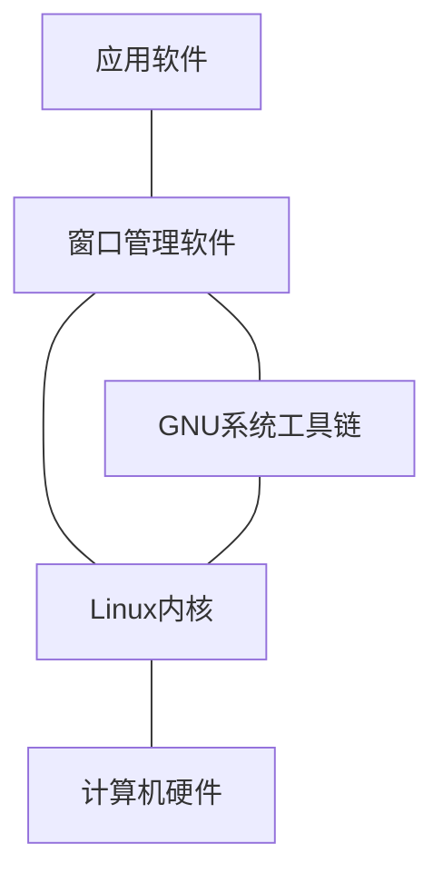

# 1 初识Linux Shell

## 1.1 什么是Linux

Linux可划分为4个部分：

- Linux内核
- GNU工具
- 图形化桌面环境
- 应用软件

Linux基本结构框图：



### 1.1.1 深入探究内核

Linux的核心是**内核**。内核控制着计算机系统上的所有硬件和软件，在必要时分配硬件，并根据需要执行软件。

内核主要负责以下四种功能：

- 系统内存管理
- 软件程序管理
- 硬件设备管理
- 文件系统管理

1. **系统内存管理**

内核不仅管理服务器上的可用物理内存，还可以创建和管理虚拟内存。

内核通过硬盘上的存储空间来实现虚拟内存，这块区域称为**交换空间**（swap space）。

内核存储单元按组划分成很多快，这些块称作**页面**。内核将每个内存页面放在物理内存或交换空间。内核维护者一个指明页面位于物理内存还是磁盘上的内存页面表。

内核自动把一段时间未访问的内存页面复制到交换空间区域（称为**换出**，swap out）。程序要访问一个已被换出的内存页面时，内核必须从物理内存换出另外一个内存页面给他让出空间，然后从交换区域换入请求的内存页面。

2. **软件程序管理**

Linux操作系统将运行中的程序称为**进程**。

内核创建了第一个进程（称为**init进程**）来启动系统上所有其他进程。内核启动时，它会将init进程加载到虚拟内存中。内核在启动其他进程时，都会在虚拟内存种给新进程分配一块专有区域来存储该进程用到的数据和代码。

3. **硬件设备管理**

任何Linux系统需要与之通信的设备，都需要在内核代码中加入其驱动程序代码。驱动程序允许内核与设备之间交换数据。

Linux内核用于插入设备驱动代码的两种方法：

- 编程进内核的设备驱动代码
- 可插入内核的设备驱动模块

Linux系统将硬件设备当成特殊的文件，称为**设备文件**。

设备文件的分类：

- 字符型设备文件
- 块设备文件
- 网络设备文件

字符型设备是指处理数据时每次只能处理一个字符的设备。多数调制解调器和终端都是作为字符型设备创建的。

块设备文件是指处理数据时每次能处理大块数据的设备，比如硬盘。

网络设备文件是指采用数据包发送和接收数据的设备，包括各种网卡和一个特殊的回环设备（允许Linux使用常见的网络编程协议同自身通信的设备）。

Linux为每个设备都创建一种称为**节点**的特殊文件。与设备的所有通信都通过设备节点完成。

4. **文件系统管理**

不同于其他一些操作系统，Linux内核支持通过不同类型的文件系统从硬盘读写数据。除自身诸多文件系统外，Linux还支持从其他操作系统采用的文件系统读写数据。

**Linux文件系统**：


| 文件系统 | 描述 |
| --- | --- |
| ext | Linux扩展文件系统，最早的Linux文件系统 |
| ext2 | 第二扩展文件系统，在ext的基础上提供了很多新功能 |
| ext3 | 第三扩展文件系统，支持日志功能 |
| ext4 | 第四扩展文件系统，支持高级日志功能 |
| hpfs | OS/2高性能文件系统 |
| jfs | IBM日志文件系统 |
| iso9660 | ISO 9660文件系统（CD-ROM） |
| minix | MINIX文件系统 |
| msdos | 微软的FAT16 |
| ncp | Netware文件系统 |
| nfs | 网络文件系统 |
| ntfs | 支持Microsoft NT文件系统 |
| proc | 访问系统信息 |
| ... | ... |

Linux内核采用虚拟文件系统（VFS）作为和每个文件系统交互的接口。当每个文件系统都被挂载和访问时，VFS将信息都缓存在内存中。

### 1.1.2 GNU工具

除了内核控制硬件设备外，操作系统还需要一些工具来执行一些标准操作，比如控制文件和程序。

1. **核心GNU工具**

GNU项目的主旨在于为Unix系统管理员设计出一套类似于Unix的环境，这促使了该项目移植了很多常见的Unix系统命令行工具。供Linux使用的这组核心工具被称为coreutils软件包。

GNU coreutils软件包由三部分构成：

- 用于处理文件的工具
- 用于操作文本的工具
- 用于管理进程的工具

2. **shell**

GNU/Linux shell是一种特殊的交互式工具。它为用户提供了启动程序、管理文件系统中的文件以及运行在Linux系统上的进程的途径。shell的核心时命令行提示符。命令行提示符是shell负责交互的部分。它允许你输入命令，然后解释命令，并在内核中运行。

shell包含了一组内部命令，使用它们可以完成诸如复制/移动/重命名文件、运行/显示/终止程序等操作。

**shell脚本**：容纳多个shell命令作为程序执行的文件。

Linux系统通常有好几种Linux shell可用。所有Linux发行版的默认shell都是bash shell。

### 1.1.3 Linux桌面环境

常见桌面环境：

- X Window系统
- KDE桌面
- GNOME桌面
- Unity桌面

# 2 走进Shell

## 2.1 进入命令行

**命令行界面**（command line interface，CLI）：只能接收文本输入，只能显示文本和基本图形输出。

进入CLI的方式：

- 控制台终端
- 图形化终端

# 3 基本的bash shell命令

## 3.4 浏览文件系统

## 3.4.1 Linux文件系统

Linux在路径名中不使用驱动器盘符。

在Windows中，PC上安装的物理驱动器决定了文件的路径名。Windows回味每个物理磁盘驱动器分配一个盘符，每个驱动器都有自己的目录结构。

Linux则将文件存储在单个目录结构中，这个目录称为**虚拟目录**。虚拟目录将安装在PC上的所有存储设备的文件路径纳入单个目录结构中。

Linux虚拟目录只包含一个称为**根**目录的基础目录

Linux使用正斜线（/）而非反斜线（\）在文件路径中划分目录。Linux用反斜线来标识转义字符。

Linux PC上安装的第一块硬盘称为**根驱动器**。根驱动器是虚拟目录的核心，其他目录都是从根驱动器开始构建的。

Linux会在根驱动器上创建一些特别的目录，即**挂载点**（mount point）。挂载点是虚拟目录中用于分配额外存储设备的目录。

**Linux文件结构**:
```
classDiagram
Disk1 o-- Disk2 : home
Disk1 : bin
Disk1 : etc
Disk1 : usr
Disk1 : var
Disk1 : home
Disk1 : ...
Disk2 : rich
Disk2 : janwee
Disk2 : ...
```

## 3.4.2 遍历目录


切换到系统中的某个特定位置：

```
$ cd destination
```

**1. 绝对文件路径**

绝对文件路径以正斜线（/）作为起始。

显示当前工作目录：

```
$ pwd
```
**2. 相对文件路径**

有两个特殊字符可用于相对路径中：

- 单点符（.），表示当前目录；
- 双点符（..），表示当前目录的父目录。

## 3.5 文件和目录列表

### 3.5.1 基本列表功能

```
$ ls
```

参数：

- -F：在目录名后加上/，在可执行文件后面加上*。
- -a: 显示包含**隐藏文件**在内的所有文件。
- -R：递归选项。

### 3.5.2 显示长列表

ls命令的-l参数可显示每个文件和目录的附加信息。

```
$ ls -l
total 2097232
lrwxrwxrwx   1 root root          7 Oct 21  2020 bin -> usr/bin
drwxr-xr-x   3 root root       4096 Oct 21  2020 home
-rw-------   1 root root 2147483648 Oct 21  2020 swapfile
```

附加信息的输出包括：

- 文件类型，如目录（d）、文件（-）、字符型文件（c）或块设备（b）等；
- 文件的权限；
- 文件的硬链接总数。
- 文件属主的用户名；
- 文件属主的组名；
- 文件的大小（以字节为单位）；
- 文件的上次修改时间；
- 文件名或目录名。


