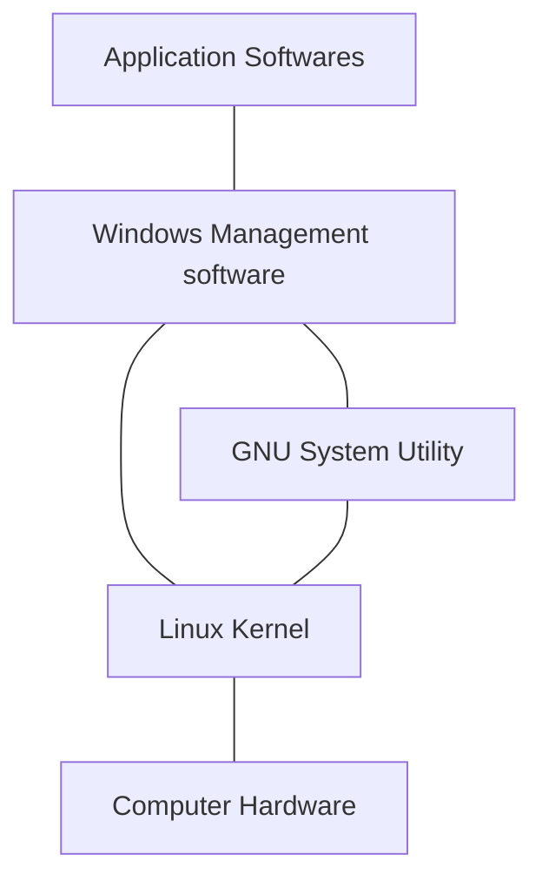

> The following are references of [*Linux Command Line and Shell Scripting Bible, 4th Edition*](https://www.amazon.com/Linux-Command-Shell-Scripting-Bible-ebook/dp/B08Q7XV6JC).

# 1. Starting with Linux

## 1.1 What is Linux

There are four main parts that make up a Linux system：

- The Linux kernel
- The GNU kernel
- A graphical desktop environment
- Application softwares

The Linux system：



### 1.1.1 Looking into the Linux Kernel

Linux的核心是**内核**。内核控制着计算机系统上的所有硬件和软件，在必要时分配硬件，并根据需要执行软件。

内核主要负责以下四种功能：

- 系统内存管理
- 软件程序管理
- 硬件设备管理
- 文件系统管理

1. **系统内存管理**

内核不仅管理服务器上的可用物理内存，还可以创建和管理虚拟内存。

内核通过硬盘上的存储空间来实现虚拟内存，这块区域称为**交换空间**（swap space）。

内核存储单元按组划分成很多快，这些块称作**页面**。内核将每个内存页面放在物理内存或交换空间。内核维护者一个指明页面位于物理内存还是磁盘上的内存页面表。

内核自动把一段时间未访问的内存页面复制到交换空间区域（称为**换出**，swap out）。程序要访问一个已被换出的内存页面时，内核必须从物理内存换出另外一个内存页面给他让出空间，然后从交换区域换入请求的内存页面。

2. **软件程序管理**

Linux操作系统将运行中的程序称为**进程**。

内核创建了第一个进程（称为**init进程**）来启动系统上所有其他进程。内核启动时，它会将init进程加载到虚拟内存中。内核在启动其他进程时，都会在虚拟内存种给新进程分配一块专有区域来存储该进程用到的数据和代码。

3. **硬件设备管理**

任何Linux系统需要与之通信的设备，都需要在内核代码中加入其驱动程序代码。驱动程序允许内核与设备之间交换数据。

Linux内核用于插入设备驱动代码的两种方法：

- 编程进内核的设备驱动代码
- 可插入内核的设备驱动模块

Linux系统将硬件设备当成特殊的文件，称为**设备文件**。

设备文件的分类：

- 字符型设备文件
- 块设备文件
- 网络设备文件

字符型设备是指处理数据时每次只能处理一个字符的设备。多数调制解调器和终端都是作为字符型设备创建的。

块设备文件是指处理数据时每次能处理大块数据的设备，比如硬盘。

网络设备文件是指采用数据包发送和接收数据的设备，包括各种网卡和一个特殊的回环设备（允许Linux使用常见的网络编程协议同自身通信的设备）。

Linux为每个设备都创建一种称为**节点**的特殊文件。与设备的所有通信都通过设备节点完成。

4. **文件系统管理**

不同于其他一些操作系统，Linux内核支持通过不同类型的文件系统从硬盘读写数据。除自身诸多文件系统外，Linux还支持从其他操作系统采用的文件系统读写数据。

**Linux文件系统**：


| 文件系统 | 描述 |
| --- | --- |
| ext | Linux扩展文件系统，最早的Linux文件系统 |
| ext2 | 第二扩展文件系统，在ext的基础上提供了很多新功能 |
| ext3 | 第三扩展文件系统，支持日志功能 |
| ext4 | 第四扩展文件系统，支持高级日志功能 |
| hpfs | OS/2高性能文件系统 |
| jfs | IBM日志文件系统 |
| iso9660 | ISO 9660文件系统（CD-ROM） |
| minix | MINIX文件系统 |
| msdos | 微软的FAT16 |
| ncp | Netware文件系统 |
| nfs | 网络文件系统 |
| ntfs | 支持Microsoft NT文件系统 |
| proc | 访问系统信息 |
| ... | ... |

Linux内核采用虚拟文件系统（VFS）作为和每个文件系统交互的接口。当每个文件系统都被挂载和访问时，VFS将信息都缓存在内存中。

### 1.1.2 GNU工具

除了内核控制硬件设备外，操作系统还需要一些工具来执行一些标准操作，比如控制文件和程序。

1. **核心GNU工具**

GNU项目的主旨在于为Unix系统管理员设计出一套类似于Unix的环境，这促使了该项目移植了很多常见的Unix系统命令行工具。供Linux使用的这组核心工具被称为coreutils软件包。

GNU coreutils软件包由三部分构成：

- 用于处理文件的工具
- 用于操作文本的工具
- 用于管理进程的工具

2. **shell**

GNU/Linux shell是一种特殊的交互式工具。它为用户提供了启动程序、管理文件系统中的文件以及运行在Linux系统上的进程的途径。shell的核心时命令行提示符。命令行提示符是shell负责交互的部分。它允许你输入命令，然后解释命令，并在内核中运行。

shell包含了一组内部命令，使用它们可以完成诸如复制/移动/重命名文件、运行/显示/终止程序等操作。

**shell脚本**：容纳多个shell命令作为程序执行的文件。

Linux系统通常有好几种Linux shell可用。所有Linux发行版的默认shell都是bash shell。

### 1.1.3 Linux桌面环境

常见桌面环境：

- X Window系统
- KDE桌面
- GNOME桌面
- Unity桌面

# 2. Getting to the Shell

## 2.1 进入命令行

**命令行界面**（command line interface，CLI）：只能接收文本输入，只能显示文本和基本图形输出。

进入CLI的方式：

- 控制台终端
- 图形化终端

# 3. Basic Bash Shell Commands

## 3.1 Starting the Shell

The GNU Bash shell is a program that provides interactive access to the Linux system. It runs as a regular program and is normally started whenever a user logs into a terminal.

The shell that the system starts depends on your user ID configuration. The */etc/passwd* file contains a list of all the system user accounts, along with basic configuration information about each user. Here's a sample:

```
root:x:0:0:root:/root:/bin/bash
```

Every entry has seven data fields, separated by colons (:). The last field sepecifies the user's shell program, in this case it's the GNU Bash shell program.

## 3.4 Navigating the Filesystem

## 3.4.1 Looking at the Linux filesystem

Linux在路径名中不使用驱动器盘符。

在Windows中，PC上安装的物理驱动器决定了文件的路径名。Windows会为每个物理磁盘驱动器分配一个盘符，每个驱动器都有自己的目录结构。

Linux则将文件存储在单个目录结构中，这个目录称为**虚拟目录**。虚拟目录将安装在PC上的所有存储设备的文件路径纳入单个目录结构中。

Linux虚拟目录只包含一个称为**根**目录的基础目录

Linux使用正斜线（/）而非反斜线（\）在文件路径中划分目录。Linux用反斜线来标识转义字符。

Linux PC上安装的第一块硬盘称为**根驱动器**。根驱动器是虚拟目录的核心，其他目录都是从根驱动器开始构建的。

Linux会在根驱动器上创建一些特别的目录，即**挂载点**（mount point）。挂载点是虚拟目录中用于分配额外存储设备的目录。

**Linux文件结构**:


## 3.4.2 Traversing directories

切换到系统中的某个特定位置：

```
$ cd destination
```

#### Using absolute directory references

绝对文件路径以正斜线（/）作为起始。

显示当前工作目录：

```
pwd: pwd [-LP]
    Print the name of the current working directory.
    
    Options:
      -L	print the value of $PWD if it names the current working
    		directory
      -P	print the physical directory, without any symbolic links
```

#### Using relative directory references

有两个特殊字符可用于相对路径中：

- 单点符（.），表示当前目录；
- 双点符（..），表示当前目录的父目录。

## 3.5 Listing Files and Directories

### 3.5.1 Displaying a basic listing

```
Usage: ls [OPTION]... [FILE]...
List information about the FILEs (the current directory by default).
Sort entries alphabetically if none of -cftuvSUX nor --sort is specified.

Options:
  -a, --all                  do not ignore entries starting with .
  -A, --almost-all           do not list implied . and ..
      --author               with -l, print the author of each file
  -F, --classify             append indicator (one of */=>@|) to entries
      --file-type            likewise, except do not append '*'
      --format=WORD          across -x, commas -m, horizontal -x, long -l,
                               single-column -1, verbose -l, vertical -C
      --full-time            like -l --time-style=full-iso
  -l                         use a long listing format
  -r, --reverse              reverse order while sorting
  -R, --recursive            list subdirectories recursively
  -1                         list one file per line
```

option参数：

- `-F`：在目录名后加上`/`，在可执行文件后面加上`*`。
- `-a`: 显示包含**隐藏文件**在内的所有文件。
- `-R`：递归选项。

### 3.5.2 Displaying a long listing

`ls` 命令的 `-l` 参数可显示每个文件和目录的附加信息。

```
$ ls -l
total 2097232
lrwxrwxrwx   1 root root          7 Oct 21  2020 bin -> usr/bin
drwxr-xr-x   3 root root       4096 Oct 21  2020 home
-rw-------   1 root root 2147483648 Oct 21  2020 swapfile
```

附加信息的输出包括：

- 文件类型，如目录（d）、文件（-）、字符型文件（c）或块设备（b）等；
- 文件的权限；
- 文件的硬链接总数。
- 文件属主的用户名；
- 文件属主的组名；
- 文件的大小（以字节为单位）；
- 文件的上次修改时间；
- 文件名或目录名。

### 3.5.3 Filtering listing output

`ls` 命令能识别标准通配符，并在过滤器中对它们进行模式匹配：

- 问号（`?`）代表一个字符；
- 星号（`*`）代表零个或多个字符。
- ...

```
$ ls -l do*
-rw-r--r-- 1 root root 869 Feb  5 09:36 do_not_go_gentle.txt
```

## 3.6 Handling Files

### 3.6.1 Creating files

创建空文件、改变文件的修改时间：

```
Usage: touch [OPTION]... FILE...
Update the access and modification times of each FILE to the current time.

A FILE argument that does not exist is created empty, unless -c or -h
is supplied.

A FILE argument string of - is handled specially and causes touch to
change the times of the file associated with standard output.
```

### 3.6.2 Copying files

```
Usage: cp [OPTION]... [-T] SOURCE DEST
  or:  cp [OPTION]... SOURCE... DIRECTORY
  or:  cp [OPTION]... -t DIRECTORY SOURCE...
Copy SOURCE to DEST, or multiple SOURCE(s) to DIRECTORY.

Mandatory arguments to long options are mandatory for short options too.
  -f, --force                  if an existing destination file cannot be
                                 opened, remove it and try again (this option
                                 is ignored when the -n option is also used)
  -i, --interactive            prompt before overwrite (overrides a previous -n
                                  option)
  -R, -r, --recursive          copy directories recursively
      --reflink[=WHEN]         control clone/CoW copies. See below
      --remove-destination     remove each existing destination file before
                                 attempting to open it (contrast with --force)
      --sparse=WHEN            control creation of sparse files. See below
      --strip-trailing-slashes  remove any trailing slashes from each SOURCE
                                 argument
  -s, --symbolic-link          make symbolic links instead of copying
```

cp命令中也可以使用模式匹配。

### 3.6.4 Linking files

Two types of file links are available in Linux：

- A symbolic link
- A hard link

**A symbolic link**, also called a soft link, is simply a physical file that points to another file somewhere in the virtual directory structure. The two symbolically linked together files do not share the same contents.

To create a symbolic link, the original file must already exist.

The hard link creates a separate file that contains information about the original file and where to locate it. When you reference the hard link file, it's just as if you're referencing the original file.

Create link：

```
用法：ln [选项]... [-T] 目标 链接名
　或：ln [选项]... 目标
　或：ln [选项]... 目标... 目录
　或：ln [选项]... -t 目录 目标...
在第一种格式中，创建具有指定<链接名>且指向指定<目标>的链接。
在第二种格式中，在当前目录创建指向<目标>位置的链接。
在第三、四种格式中，在指定<目录>中创建指向指定<目标>的链接。
默认创建硬链接，当使用--symbolic 时创建符号链接。
默认情况下，创建每个目标时不应存在与新链接的名称相同的文件。
创建硬链接时，每个指定的<目标>都必须存在。符号链接可以指向任意的位置；
当链接解析正常时，将其解析为一个相对于其父目录的相对链接。

必选参数对长短选项同时适用。
      --backup[=CONTROL]      为每个已存在的目标文件创建备份文件
  -b                          类似--backup，但不接受任何参数
  -d, -F, --directory         允许超级用户尝试创建指向目录的硬链接
                              （注意：此操作可能因系统限制而失败)
  -f, --force                 强行删除任何已存在的目标文件
  -i, --interactive           删除目标文件前进行确认
  -L, --logical               如目标为符号链接，本次创建链接时将其解引用
  -n, --no-dereference        如果给定<链接名>是一个链接至某目录的符号链接，
                                将其作为普通文件处理
  -P, --physical              创建直接指向符号链接文件的硬链接
  -r, --relative              创建相对于链接位置的符号链接
  -s, --symbolic              创建符号链接而非硬链接
  -S, --suffix=后缀           自行指定备份文件的后缀
  -t, --target-directory=目录  在指定<目录>中创建链接
  -T, --no-target-directory   总是将给定的<链接名>当作普通文件
  -v, --verbose               列出每个链接的文件名称
```

## 3.7 Managing Directories

### 3.7.1 Creating directories

创建目录的命令：

```
mkdir [OPTION]... DIRECTORY...
```

也可以使用 `mkdir` 命令地 `-p` 选项“批量”地创建目录和子目录。

### 3.7.2 Deleting directories

The basic command for removing a directory is:

```
rmdir [OPTION]... DIRECTORY...
```

By default, the `rmdir` command works only for removing *empty* directories.

The `rmdir` has no `-i` option to ask if you want to remove the directory.

You can also use the `rm` command on entire nonempty directories. Using the `-r` option allows the command to descend into the directory, remove the files, and then remove the directory itself.

The ultimate solution for quickly deleting a directory tree is the `rm -rf` command. It gives no warnings and no messages, and it just deletes the directory specified and all its contents.

## 3.8 Viewing File Contents

You can use serval commands for looking indide files without having to pull out a text editor utility.

### 3.8.1 Viewing the file type

The `file` command is a handy little utility. It can peek inside a file and determine just what kind of file it is.

The `file` command determined not only that the file contains text but also the character code format of the text file, ASCII:

```
$ file hello.txt 
hello.txt: ASCII text
```
It can give you another method to distinguish a directory:

```
$ file bin
bin: directory
```

The following example shows a file that is a symbolic link and which file it is symbolically linked:

```
$ file man
man: symbolic link to share/man
```

The example below shows what the command returns for a script file:
```
$ file my_script
my_script: Bourne-Again shell script, ASCII text executable
```

The final example is a binary executable program. The command determines the platform that the program was compiled for and what types of libraries it requires:

```
$ file kubelet
kubelet: ELF 64-bit LSB executable, x86-64, version 1 (SYSV), dynamically linked, interpreter /lib64/ld-linux-x86-64.so.2, BuildID[sha1]=2247cf948cf079f8ad8339a92cd443f38c4fc350, for GNU/Linux 3.2.0, stripped
```

### 3.8.2 Viewing the whole file

#### Using the `cat` command

Usage of the `cat` command:

```
cat [OPTION]... [FILE]...
```

The `-n` parameter numbers all the line for you.

```
$ cat -n 长相思.txt
     1	山一程，水一程，
     2	身向榆关那畔行，
     3	夜深千帐灯。
     4	风一更，雪一更，
     5	聒碎乡心梦不成，
     6	故园无此声。
```

The `-b` parameter let you number the lines that have text in them.

#### Using the more command

```
more [options] <file>...
```

When you are finished navigating through the file using `more`, type **q** to quit.

For more advanced features, try the `less` command.

#### Using less command.

One set of features is that the  `less` command recognize the up and down arrow keys as well as yje Page Up and Page Down keys.

### 3.8.3 Viewing part of a file

#### Using the `tail` command

The `tail` command displays the last lines in a file. By default, it shows the last 10 lines in the file.

```
Usage: tail [OPTION]... [FILE]...
Print the last 10 lines of each FILE to standard output.
With more than one FILE, precede each with a header giving the file name.
```

The `-f` parameter is a pretty cool feature of the `tail` command. It allows you to peek inside a file as the file is being used by other process. The `tail` command stays active and continues to display new lines as they appear in the text file. This is a great way to monitor the system log files in real-time mode.

#### Using the `head` command

```
Usage: head [OPTION]... [FILE]...
Print the first 10 lines of each FILE to standard output.
With more than one FILE, precede each with a header giving the file name.
```

# 4. More Bash Shell Commands

## 4.1 Monitoring Programs

### 4.1.1 Peeking at the processes

The basic `ps` command doesn't provide all that much imformation：

```
$ ps
    PID TTY          TIME CMD
   2688 pts/0    00:00:00 bash
   2697 pts/0    00:00:00 ps
```

By default the ps command shows only the processes that belongs to the current user and that are running on the current terminal.

The basic output shows the process ID ( `PID` ) of the programs, the terminal ( `TTY` ) that they are running from, and the CPU time the process has used.

The GNU `ps` command that's used in Linux systems supports three different types of command-line parameters:

- Unix-style parameters, which are preceded by a dash.
- BSD-style parameters, which are not preceded by a dash.
- GNU long parameters, which are preceded by a double dash.

#### Unix-style parameters


| Parameter | Description |
| --- | --- |
| `-A` | Show all processes. |
| `-N` | Show the oppsite of specified parameters. |
| `-a` | Show all processes except session headers and processes without a terminal. |
| `-d` | Show all processes except session headers. |
| `-e` | Show all processes. |
| `-C <cmdlist>` | Show processes contained in the list `cmdlist`. |
| `-G <grplist>` | Show processes with a group ID listed in `grplist`. |
| `-U <userlist>` | Show processes owned by a user ID listed in `userlist`. |
| `-g <grplist>` | Show processes by session or by group ID contained in `grplist`. |
| `-p <pidlist>` | Show processes with PIDs in the list `pidlist`. |
| `-f` | Display a full format listing. |
| `-l` | Display a long listing. |
| ... | ... |

Use the `-ef` parameter combination to see everything running on the system:

```
ps -ef
UID          PID    PPID  C STIME TTY          TIME CMD
root           1       0  0  2022 ?        00:46:56 /sbin/init
root           2       0  0  2022 ?        00:00:04 [kthreadd]
root           3       2  0  2022 ?        00:00:00 [rcu_gp]
...
root     3058187       2  0 03:00 ?        00:00:00 [kworker/u4:2-events_power_efficient]
root     3059439 3018866  0 03:02 pts/0    00:00:00 ps -ef
```
A few useful columns of informations above:

- `UID`: The user responsible for lauching the process
- `PID`: The process ID of the process
- `PPID`: The PID of the parent process
- `C`: Processor utilization over the lifetime of the process
- `STIME`: The system time when the process started
- `TTY`: The terminal device from which the process was launched
- `TIME`: The cumulative CPU time required to run the process
- `CMD`: The name of the program that was started

For even moreinformation, use the `-l` parameter.

#### BSD-style parameters

The Berkeley Software Distribution (BST) was a version of Unix developed at the University of California, Berkeley.


| Parameter | Description |
| --- | --- |
| `T`| Show all processes associated with this terminal. |
| `a` | Show all processes associated with any terminal. |
| `g` | Show all processes, including session headers. |
| `r` | Show only running processes. |
| ... | ... |

#### The GNU long parameters

| Parameter | Description |
| --- | --- |
| `--deselect` | Show all processes except those listed in the command line. |
| `--Group <grplist>` | Show processes whose group ID is listed in grplist. |
| `-User <userlist>` | Show processes whose user ID is listed in userlist. |
| ... | ... |

### 4.1.2 Real-time process monitoring

The `ps` command can display information for only a specific point in time. 

The `top` command displays process information similarly to the `ps` command, but it does so in real-time mode.

```
top - 03:23:13 up 69 days, 13:01,  1 user,  load average: 0.32, 0.36, 0.42
Tasks: 167 total,   1 running, 166 sleeping,   0 stopped,   0 zombie
%Cpu(s):  6.9 us,  4.2 sy,  0.0 ni, 88.6 id,  0.0 wa,  0.0 hi,  0.2 si,  0.2 st
MiB Mem :   2488.5 total,     82.8 free,    808.9 used,   1596.8 buff/cache
MiB Swap:   2048.0 total,   1589.7 free,    458.2 used.   1375.4 avail Mem 

    PID USER      PR  NI    VIRT    RES    SHR S  %CPU  %MEM     TIME+ COMMAND                                                                                                                        
 287678 root      20   0 1116868 229112  22316 S   4.7   9.0   2252:15 kube-apiserver                                                                                                                 
 299992 root      20   0 1937668  57192  18480 S   2.3   2.2   1538:50 kubelet
```

The first selction of the output shows general system  information. The next section shows a detailed list of the current running processes.

Some information columns of the `top` command:

- **PID**
- **USER**
- **PR**: The priority of the process
- **NI**: The nice value of the process
- **VIRT**: The total amount of virtual memory used by the process
- **RES**: The amount of physical memory the process is using
- **SHR**: The amount of memory the process is sharing with other processes
- **S**: The process status (D = interruptible sleep, R = running, S = sleeping, T = traced or stopped, or Z = zombie)
- **%CPU**: The share of CPU time that the process is using
- **%MEM**: The share of available physical memory the process is using
- **TIME+**: The total CPU time the process has used since starting
- **COMMAND**: The command-line name of the process (program started)

### 4.1.3 Stopping process

In Linux, processes communicate with each other using *signals*, predifined messages that processes recognize and may choose to ignore or act on.

**TABLE: Linux Process Signals**


| Signal | Name | Description |
| --- | --- | --- |
| 1 | HUP | Hang up. |
| 2 | INT | Interrupt. |
| 3 | QUIT | Stop running. |
| 9 | KILL | Unconditionally terminate. |
| 11 | SEGV | Segment violation. |
| 15 | TERM | Terminate if possible. |
| 17 | STOP | Stop unconditionally but don't terminate. |
| 18 | TSTP | Stop or pause but continue to run in background. |
| 19 | CONT | Resume execution after STOP or TSTP. |

#### The `kill` command

Usage of `kill` command:

```
kill: kill [-s sigspec | -n signum | -sigspec] pid | jobspec ... or kill -l [sigspec]
```

By default, the `kill` command sends a *TERM* signal to all the PIDs listed on the command line. To send a process signal, you must either be the owner of the process or be logged in as the root user.

The **TERM** signal tells the process to stop running. A runaway process most likely will ignore the request. The `-s` parameter allows you to specify other signals.

No output is associated with the `kill` command:

```
$ kill -s HUP 807
```

To see if the command was effective, you'll have to perform another `ps` or `top` command.

#### The `pkill` command

The `pkill` command is a way to stop process by using their names rather than the PID numbers, it allows you to use wildcard characters as well:

Usage of `pkill`:
```
pkill [options] <pattern>
```

## 4.2 Monitoring Disk Space

### 4.2.1 Mounting media

The task which places a new media disk in the virtual directory is called *mounting*.

#### The `mount` command

Usage of `mount` command:

```
 mount [-lhV]
 mount -a [options]
 mount [options] [--source] <source> | [--target] <directory>
 mount [options] <source> <directory>
 mount <operation> <mountpoint> [<target>]
```

By default, the `mount` command displays a list of media devices currently mounted on the system.

The output of the `mount` command can be very cluttered and confusing because there would be lots of virtual filesystems for management purposes besides your standard storage devices.

You can use `-t` parameter to limit the set of filesystem types:

```
$ mount -t ext4
/dev/vda1 on / type ext4 (rw,relatime,errors=remount-ro)
```

The `mount` command provides four pieces of information:
- The device filename of the media
- The mount point in the virtual directory where the media is mountted
- The filesystem type
- The access status of the mounted media

The basic command for manually mounting a media device:

```
mount -t type device directory
```

#### The `umount` command

To remove a removable media device, *unmount* it first, then remove it from the system.

The command used to unmount devices is `umount` (not "unmount").

Usage of `umount` command:

```
umount [-hV]
umount -a [options]
umount [options] <source> | <directory>
```

The `umount` command gives you the choice of defining the media device by either its device location or its mounted directory name.

#### The `df` command

Usage of `df` command:

```
df [OPTION]... [FILE]...
```

Use `-t` parameter to filter the output by specifying the filesystem type.

```
df -t ext4
Filesystem     1K-blocks     Used Available Use% Mounted on
/dev/vda1       54694496 15081256  36818308  30% /
```

> 1K-blocks: How many 1024-byte blocks of data the media can hold
> Used: Used 1024-bytes blocks
> Available: Available 1024-bytes blocks

Use `-h` parameter to show the disk space in human-readable form:

```
# df -h
Filesystem      Size  Used Avail Use% Mounted on
udev            1.2G     0  1.2G   0% /dev
tmpfs           249M  660K  249M   1% /run
tmpfs           1.3G     0  1.3G   0% /sys/fs/cgroup
```

#### The `du` command

The `du` command shows the disk usage of a specific directory.

Usage:

```
Usage: du [OPTION]... [FILE]...
  or:  du [OPTION]... --files0-from=F
```

By default, the `du` command displays all the files, directories, and subdirectories under the current directory.

Use the following command-line parameters with the `du` command to make the output more legible:

- `-c`: produce a grand total
- `-h`: print sizes in human readable format
- `-s`: display only a total for each argument

## 4.3 Working with Data Files

### 4.3.1 Sorting data

Usage of `sort` command:

```
Usage: sort [OPTION]... [FILE]...
  or:  sort [OPTION]... --files0-from=F
Write sorted concatenation of all FILE(s) to standard output.
```

By default, the `sort` command sorts the data lines in a text file using standard sorting rules for the language you specify as the default for the session:

```
$ sort weekdays.txt
Friday
Monday
Saturday
Sunday
Thursday
Tuesday
Wednesday
```

Use the `-n` parameter to tell the `sort` commmand to recognize numbers and to sort them based on their numerical values:

```
$ sort -n numbers.txt
1
2
6
10
33
```

Use the `-M` parameter to do the month sort:

```
$ sort -M somelog.log 
Jan 1 01:01:01 Device opened
Jan 1 08:20:01 Device closed
Jan 1 09:08:15 Device shut down
Apr 13 07:10:09 Device opened
```

The `-k` and `-t` parameters are handy when sorting data that uses fields, such as the `/etc/passwd` file. Use the `-t` parameter to specify the field separator character, and use the `-k` parameter to specify which field to sort on.

For example:

```
$ sort -t ':' -k 5 /etc/passwd
backup:x:34:34:backup:/var/backups:/usr/sbin/nologin
bin:x:2:2:bin:/bin:/usr/sbin/nologin
daemon:x:1:1:daemon:/usr/sbin:/usr/sbin/nologin
...
www-data:x:33:33:www-data:/var/www:/usr/sbin/nologin
```

### 4.3.2 Searching for data

Usage of `grep` command:

```
grep [OPTION]... PATTERNS [FILE]...
```

The `grep` command searches either the input or the file specified:

```
$ ls | grep 3
textfile3.txt

$ grep three numbers.txt
three
```

Use the `-v` parameter to reverse the search:

```
$ grep -v three numbers.txt
one
two
```

Use the `-n` parameter to output the line numbers where the patterns are found:

```
$ grep -vn three numbers.txt
1:one
2:two
```

Use the `-c` parameter to count how many lines contain the matching pattern:

```
$ grep -vc three numbers.txt
2
```

Use the `-e` parameter to specify more than one matching pattern:

```
$ grep -e one -e three numbers.txt
one
three
```

By default, the `grep` command uses basic UNIX-style regular expressions, which uses special characters to define how to look for matching patterns, to match patterns. 

Here's a simple example:

```
$ grep [TF] weekdays.txt 
Tuesday
Thursday
Friday
```

The `egrep` command is an offshoot of `grep`, which alows you to specify POSIX extended regular expressions. The `fgrep` command is another version that allows you to specify matching patterns as a list of fixed-string values, separated by newline charaters. 

# 5. Understanding the Shell

## 5.1 Investing Shell Types

==TBC==

## 5.2 Exploring Parent and Child Shell Relationships

### 5.2.1 Looking at process list

When the `/bin/bash` command or the equivalent `bash` command is entered at the CLI prompt, a new shell program is created. This is a child shell. A child shell also has a CLI prompt and waits for commands to be entered.

A subshell can be created from a parent shell, and a subshell can be created from another subshell:

```
$ ps -f --forest
UID          PID    PPID  C STIME TTY          TIME CMD
root     3222724 3222464  0 Feb25 pts/0    00:00:00 bash
root      950314  950104  0 Feb11 pts/0    00:00:00 bash
root      279698  279659  0 02:35 pts/0    00:00:00 -bash
root      279742  279698  0 02:35 pts/0    00:00:00  \_ bash
root      280220  279742  0 02:39 pts/0    00:00:00      \_ bash
root      280304  280220  0 02:40 pts/0    00:00:00          \_ ps -f --forest
```

- `echo $BASH_SUBSHELL`: Indicates if a subshell was spawned. If it returns a 0, then there is no subshell. If it returns 1 or more, then there is a subshell.

For example:

```
$ (pwd ; ls ; echo $BASH_SUBSHELL)
/root
client_config  dates                   Document                                          jcnf.sh           newfile2      rtps              somelog.log
containers     debug-2022-11-26.0.log  emailformhy@163.com_2022-11-26T05_00_25.517Z.pem  log_r_client.log  nf            script1           virt-sysprep-firstboot.log
contents       Dockerfiles             gz_client_bot.tar.gz                              newfile           r_client.jar  sh_client_bot.sh
1
```

Gracefully exit out of each subshell by entering the `exit` command.

### 5.2.2 Creatively using subshells

**Investigating background mode**

- `sleep NUMBER`: Accepts as a parameter the number of seconds you want the process to wait (sleep). 

```
$ sleep 5

```

To put a command into background mode, the & character is tacked onto its end. 

```
$ sleep 60&
[1] 288749
```

- `jobs`: Displays background job 
information. 

```
$ jobs
[1]+  Running                 sleep 60 &
```

When the background job is fi nished, its completion status is displayed:

```
$ jobs
[1]+  Done                    sleep 60
```

**Putting process lists into the background**

Using a process list including sleep commands and displaying the BASH_SUBSHELLvariable operates as you would expect:

```
$ (sleep 2 ; echo $BASH_SUBSHELL ; sleep 2)
1
```

==TBC==

# 6 Linux环境变量

## 6.5 设置 `PATH` 环境变量

```
$ echo $PATH
/usr/local/sbin:/usr/local/bin:/usr/sbin:/usr/bin:/sbin:/bin:/usr/games:/usr/local/games
$ PATH=$PATH:/root
$ echo $PATH
/usr/local/sbin:/usr/local/bin:/usr/sbin:/usr/bin:/sbin:/bin:/usr/games:/usr/local/games:/root
```
## 6.6 定位系统环境变量

启动bash shell有以下3种方式：

- 登录时作为默认shell。
- 作为交互式shell，通过生成子shell启动。
- 作为运行脚本的非交互式shell。

### 6.6.1 登录shell

登录shell会从几个不同的启动文件种读取命令，通常包括：

- /etc/profile
- $HOME/.bash_profile
- $HOME/.bashrc
- $HOME/.bash_login
- $HOME/.profile

**1. /etc/profile文件**

/etc/profile文件时bash shell默认的主启动文件。


# 7. Understanding Linux File Permissions

## 7.1 Exploring the Linux Security

The core of the Linux security is the *user account*.

### 7.1.1 The */etc/passwd* file

```
$ cat /etc/passwd
root:x:0:0:root:/root:/bin/bash
daemon:x:1:1:daemon:/usr/sbin:/usr/sbin/nologin
...
janwee:x:1000:1000:janwee,,,:/home/janwee:/bin/bash
systemd-coredump:x:999:999:systemd Core Dumper:/:/usr/sbin/nologin
```

该文件各个字段的含义：

- 登录用户名
- 用户密码
- 用户账户的UID
- 用户账户的组ID
- 用户账户的文本描述
- 用户 `$HOME` 目录的位置
- 用户的默认shell

### 7.1.2 The */etc/shadow* file

绝大多数Linux系统将用户密码保存在单独的 */etc/shadow* 文件中。

```
# cat /etc/shadow | grep janwee
janwee:$1$tuiga5ml$rjAuW.6jgg/0KJDbaLHnZ0:18556:0:99999:7:::
```

/etc/shadow 文件中每条记录共包含9个字段。

- 登录名
- 加密后的密码自上次修改密码后已经过去的天数
- 多少天后才能更改密码
- 密码过期前提前多少天提醒用户更改密码
- 密码过期后多少天禁用用户账户
- 用户账户被禁用的日期
- 预留给以后使用的字段

### 7.1.3 Adding a new user

<To be continued>

### 7.1.4 Removing a user

<To be continued>

### 7.1.5 Modifying a user

<To be continued>

## 7.3 理解文件权限

### 7.3.1 使用文件权限符号

```
$ ls -l
total 44
drwxr-xr-x 3 root             root 4096 Feb 10 22:14 1_softwares
drwxr-xr-x 2 root             root 4096 Aug  1  2020 src
```

输出结果的第一个字段是描述文件和目录权限的编码。第一个字符表示对象的类型：


| 值 | - | d | l | c | b | p | s |
| --- | --- | --- | --- | --- | --- | --- | --- |
| 描述 | 文件 | 目录 | 链接 | 字符设备 | 块设备 | 具名管道 | 网络套接字 |

之后是3组三字符的编码。每一组定义了3种访问权限。3组权限分别对应对象的3个安全级别：

- 对象的属主
- 对象的属组
- 系统其他用户

### 7.3.2 默认文件权限

`umask`命令可用于显示和设置默认权限：

```
$ umask
0022
$ touch newfile
$ ls -al newfile
-rw-r--r-- 1 root root 0 Mar  1 16:26 newfile
```

第一个数位代表一项特别的安全特性。接下来的3个数位表示文件或目录对应的`umask`八进制值。

八进制模式的安全设置先获取rwx权限值，然后将其转换为3位二进制值，用一个八进制来表示。

例如，若读权限是唯一置位的权限，则权限值是 `r--`，转换为二进制值就是100，代表的八进制值是4。

`umask`实际值只是个掩码，它会屏蔽掉不想授予该安全级别的权限。

要把`umask`值从对象的全权限值种减掉。文件的全权限值是666（所有用户都有读取和写入的权限），目录的全权限值是777（所有用户都有读取、写入和执行的权限）。

所以上述例子中文件一开始的权限是666，减去umask值022之后，剩下的文件权限就成了744。

指定其他的umask默认值：

```
$ umask 026
$ touch newfile2
$ ls -al newfile2
-rw-r----- 1 root root 0 Mar  1 16:26 newfile2
```

## 7.4 更改安全设置

### 7.4.1 修改权限

- `chmod`

```
chmod [OPTION]... MODE[,MODE]... FILE...
  or:  chmod [OPTION]... OCTAL-MODE FILE...
  or:  chmod [OPTION]... --reference=RFILE FILE...
```

`mode` 参数允许使用八进制模式或符号模式来进行安全设置。

```
$ chmod 760 newfile
$ ls -l newfile
-rwxrw---- 1 root root 0 Mar  1 16:26 newfile
```

下面是在符号模式下指定权限的格式：

```
[ugoa]*([-+=]([rwxXst]*|[ugo]))+|[-+=][0-7]+
```
第一组字符含义：

- u代表属主用户
- g代表属组用户
- o代表其他用户
- a代表以上所有

第二组字符含义：

- +代表在现有基础上增加权限
- -代表移除权限
- =代表设置权限

第三组字符含义：

- X：仅当对象是目录或者已有执行权限时才赋予执行权限。
- s：在执行时设置SUID或SGID。
- t：设置沾滞位。
- u：设置属主权限。
- g：设置属组权限。
- o：设置其他用户权限。

==TBC==

# 11. Basic Script Building

## 11.2 Creating a Script File

When creating a shell script file, you must specify the shell you are using in the first line of the file. Here’s the format for this:

```
#!/bin/bash
```

The `PATH` environment variable is set to look for commands only in a handful of directories. To get the shell to find a script, we need to do one of two things:

- Add the directory where our shell script fi le is located to the PATH environment 
variable.
- Use an absolute or relative file path to reference our shell script fi le in the prompt.

For example：

```
$ chmod u+x script1
$ ls -l script1
-rwxr--r-- 1 root root 23 Mar  2 01:23 script1
$ ./script1
```

## 11.4 Using Variables

### 11.4.1 Environment variables

- `set` command：Displays a complete list of active environment variables available.

You can tap into these environment variables from within your scripts by using the environment variable’s name preceded by a dollar sign. This is demonstrated in the following script:

```
#!/bin/bash
echo "Current user is $USER"
```

### 11.4.2 User variables

User variables can be any text string of up to 20 letters, digits, or an underscore character. User variables are case sensitive.

Values are assigned to user variables using an equal sign.

```
book="The Song of Ice and Fire"
author="George R. R. Martin"
```

Variables defi ned within the shell script maintain their values throughout the life of the shell script but are deleted when the shell script completes.

It’s important to remember that when referencing a variable value you use the dollar sign, but when referencing the variable to assign a value to it, you do not use the dollar sign. Here’s an example:

```
book="The Song of Ice and Fire"
author="George R. R. Martin"
output="$author 's $book"
echo $output
```

And the output when executing this shell script will be:

```
George R. R. Martin 's The Song of Ice and Fire
```

### 11.4.3 Command substitution

One of the most useful features of shell scripts is the ability to extract information from the output of a command and assign it to a variable. After you assign the output to a variable, you can use that value anywhere in your script. 

Two ways to assign the output of a command to a variable:

- The backtick character(`)
- The `$()` format

For example:

```
time=`date +%y%m%d`
```

or:

```
time=$(date +%y%m%d)
```

## 11.5 Redirecting Input and Output

### 11.5.1 Output redirection

- `command > outputfile`: sedning output from a command to a file.

For example:

```
$ date > dates
$ cat dates
Fri 03 Mar 2023 05:17:41 AM GMT
```

- `command >> filename`: Append output from a command to an existing file. 

For example:

```
$ date >> dates
$ cat dates
Fri 03 Mar 2023 05:17:41 AM GMT
Fri 03 Mar 2023 05:22:35 AM GMT
```

### 11.5.2 Input direction

- `command < inputfile`: Takes the content of a file and redirects it to a command.

```
$ wc < dates
 2 14 64
```

- `wc` command: Print newline, word, and byte counts for each FILE, and a total line if
more than one FILE is specified.

```
command << marker
data
marker
```
Another method of input redirection is called inline input redirection. This method allows you to specify the data for input redirection on the command line instead of in a file. 

```
$ wc << EOF
> 
> test string 1
> test string 2
> EOF
 3  6 29
```

## 11.6 Pipes

Sometimes, you need to send the output of one command to the input of another command. This is possible using redirection, but somewhat clunky:

```
$ ls > contents
$ sort < contents
client_config
containers
contents
dates
debug-2022-11-26.0.log
```

- `command1 | command2`:  Redirects the output to another 
command. This process is called *piping*.

For example:

```
$ ls | sort
client_config
containers
contents
dates
debug-2022-11-26.0.log
```

The Linux system actually runs both commands at the same time, linking them together internally in the system.

```
$ ls --sort=time | sort | more
[
aa-enabled
aa-exec
addpart
appres
apt
apt-cache
```

You can use redirection along with piping to save your output to a file:

```
$ ls --sort=time | sort > sorted.list
```

## 11.7 Performing Math

- `expr` command:  Allowes the processing of equations from the command line.

Usage: 

```
Usage: expr EXPRESSION
  or:  expr OPTION

      --help     display this help and exit
      --version  output version information and exit

Print the value of EXPRESSION to standard output.  A blank line below
separates increasing precedence groups.  EXPRESSION may be:

  ARG1 | ARG2       ARG1 if it is neither null nor 0, otherwise ARG2

  ARG1 & ARG2       ARG1 if neither argument is null or 0, otherwise 0

  ARG1 < ARG2       ARG1 is less than ARG2
  ARG1 <= ARG2      ARG1 is less than or equal to ARG2
  ARG1 = ARG2       ARG1 is equal to ARG2
  ARG1 != ARG2      ARG1 is unequal to ARG2
  ARG1 >= ARG2      ARG1 is greater than or equal to ARG2
  ARG1 > ARG2       ARG1 is greater than ARG2

  ARG1 + ARG2       arithmetic sum of ARG1 and ARG2
  ARG1 - ARG2       arithmetic difference of ARG1 and ARG2

  ARG1 * ARG2       arithmetic product of ARG1 and ARG2
  ARG1 / ARG2       arithmetic quotient of ARG1 divided by ARG2
  ARG1 % ARG2       arithmetic remainder of ARG1 divided by ARG2

  STRING : REGEXP   anchored pattern match of REGEXP in STRING

  match STRING REGEXP        same as STRING : REGEXP
  substr STRING POS LENGTH   substring of STRING, POS counted from 1
  index STRING CHARS         index in STRING where any CHARS is found, or 0
  length STRING              length of STRING
  + TOKEN                    interpret TOKEN as a string, even if it is a
                               keyword like 'match' or an operator like '/'
```

```
$ expr 200 % 3
2
```

The bash shell mathematical operators support only integer arithmetic. This is a huge limitation if you’re trying to do any sort of real-world mathematical calculations.

### 11.7.3 A floating-point solution

**The basics of `bc`**

- `bc`: The bach calculator, allows you to enter floating-point expressions at a command line and then interprets the expressions, calculates them, and returns the result.

The bash calculator recognizes these:

- Numbers (both integer and floating point)
- Variables （both simple variables and arrays）
- Comments (lines starting with a pound sign or the C language /* */ pair)
- Expressions
- Programming statements (such as if-then statements)
- Functions

```
$ bc -q
3.44 / 5
0
scale=4
3.44 / 5
.6880
quit
```

**Using `bc` in scripts**

The basic format:

```
variable=$(echo "options; expression" | bc)
```

For example:

```
#!/bin/bash
ans=$(echo "scale=4; 3.44 / 5" | bc)
echo The answer is $ans
```

The best method is to use inline input redirection, which allows you to redirect data directly from the command line. In the shell script, you assign the output to a variable:

```
variable=$(bc << EOF
options
statements
expressions
EOF)
```

For example:

```
#!/bin/bash

var1=10.46
var2=43.67
var3=33.2
var4=71

var5=$(bc << EOF
scale=4
a=($var1 * $var2)
b=($var3 * $var4)
a1 + b1
EOF
)

echo the final answer is $var5
```

## 11.8 Exiting the Script

Every command that runs in the shell uses an exit status to indicate to the shell that it’s finished processing. The exit status is an integer value between 0 and 255 that’s passed by the command to the shell when the command fi nishes running. You can capture this value and use it in your scripts.

### 11.8.1 Checking the exit status

Linux provides the `$?` special variable that holds the exit status value from the last command that executed. You must view or use the $? variable immediately after the command you want to check. 

```
$ unknown_cmd
unknown_cmd: command not found
$ echo $?
127
```

**Linux Exit Status Codes**


| Code | Description |
| --- | --- |
| 0 | Successful completion of the command |
| 1 | General unknown error |
| 2 | Misuse of shell command |
| 126 | The command can’t execute |
| 127 | Command not found |
| 128 | Invalid exit argument |
| 128+x | Fatal error with Linux signal x |
| 130 | Command terminated with Ctrl+C |
| 255 | Exit status out of range |

**11.8.2 The `exit` command**

By default, your shell script exits with the exit status of the last command in your script.

```
$ cat script1
#!/bin/bash
answer=$(bc << EOF
a=10.45
b=3.2
a * b
EOF
)

echo the final result is $answer
exit 5
```

When checking the exit status of the script:

```
$ ./script1
the final result is 33.44
$ echo $?
5
```

# 12. Using Structured Commands

## 12.1 Working with the `if-then` Statement

The if-then statement has the following format:

```
if <command>
then
 <commands>
fi
```

or,

```
if <command>;then
    <commands>
fi
```

If the exit status of the command within the `if` statement is zero (the command completed successfully), the commands listed under the `then` section are executed. If the exit status of the command is anything else, the `then` commands aren’t executed, and the bash shell moves on to the next command in the script. The `fi` statement delineates the `if-then` statement’s end.

```
$ cat script1
#!/bin/bash
if pwd
then
	echo "The pwd command worked"
fi
```

## 12.2 Exploring the `if-then-else` Statement

```
if <command>
then
 <commands>
else
 <commands>
fi
```

## 12.3 Nesting `if`s

```
if <command1>
then
 <commands>
elif <command2>
then
 <more commands>
fi
```

You can continue to string elif statements together, creating one huge if-then-elif
conglomeration: 

```
if command1
then
 command set 1
elif command2
then
 command set 2
elif command3
then
 command set 3
elif command4
then
 command set 4
fi
```

## 12.4 Trying the `test` command

When used in an if-then statement, the test command looks like this:

```
if test condition
then
 commands
fi
```

or,

```
if [ condition ]
then
 commands
fi
```

If you leave out the condition portion of the test command statement, it exits with a non-zero exit status code and triggers any else block statements.

The test command and test conditions can evaluate three classes of conditions: 
- Numeric comparisons
- String comparisons
- File comparisons

### 12.4.1 Using numeric comparisons

**The test Numeric Comparisons**

| Comparison | Description |
| --- | --- |
| `n1 -eq n2` | Checks if n1 is equal to n2 |
| `n1 -ge n2` | Checks if n1 is greater than or equal to n2 |
| `n1 -gt n2` | Checks if n1 is greater than n2 |
| `n1 -le n2` | Checks if n1 is less than or equal to n2 |
| `n1 -lt n2` | Checks if n1 is less than n2 |
| `n1 -ne n2` | Checks if n1 is not equal to n2 |

### 12.4.2 Using string comparisons

**The test String Comparisons**

| Comparison | Description |
| --- | --- |
| `str1 = str2` | Checks if str1 is the same as string str2 |
| `str1 != str2` | Checks if str1 is not the same as str2 |
| `str1 < str2` | Checks if str1 is less than str2 |
| `str1 > str2` | Checks if str1 is greater than str2 |
| `-n str1` | Checks if str1 has a length greater than zero |
| `-z str1` | Checks if str1 has a length of zero |

### 12.4.3 Using file comparisons

**The test File Comparisons**

| Comparison | Description |
| --- | --- |
-d file | Checks if file exists and is a directory
-e file | Checks if file exists
-f file | Checks if file exists and is a file
-r file | Checks if file exists and is readable
-s file | Checks if file exists and is not empty
-w file | Checks if file exists and is writable
-x file | Checks if file exists and is executable
-O file | Checks if file exists and is owned by the current user
-G file | Checks if file exists and the default group is the same as the current user
file1 -nt file2 | Checks if file1 is newer than file2
file1 -ot file2 | Checks if file1 is older than file2

## 12.5 Considering Compound Testing

The `if-then` statement allows you to use Boolean logic to combine tests. You can use these two Boolean operators: 
- `[ condition1 ] && [ condition2 ]`
- `[ condition1 ] || [ condition2 ]`

## 12.6 Working with Advanced `if-then` Features

Three additions to the bash shell provide advanced features that you can use in `if-then` statements: 

- Single parentheses for executing commands in a subshell
- Double parentheses for mathematical expressions
- Double square brackets for advanced string handling functions

### 12.6.1 Using single parentheses

Here's the format of the single parentheses:

```
(command)
```

Before bash shell executing the command, a subshell will be created to execute commands. If the exit status is 0, the commands listed under the `then` section will be executed. Otherwise they won't be executed.

For example, here's *script1*:

```
#!/bin/bash
echo $BASH_SUBSHELL
if (echo $BASH_SUBSHEL)
then 
	echo "The subshell command operated successfully."
else 
	echo "The subshell command was NOT successful"
fi
```

Execute it, and we get:

```
$ ./script1 
0

The subshell command operated successfully.
```


### 12.6.2 Using double parentheses
### 12.6.3 Using double square brackets