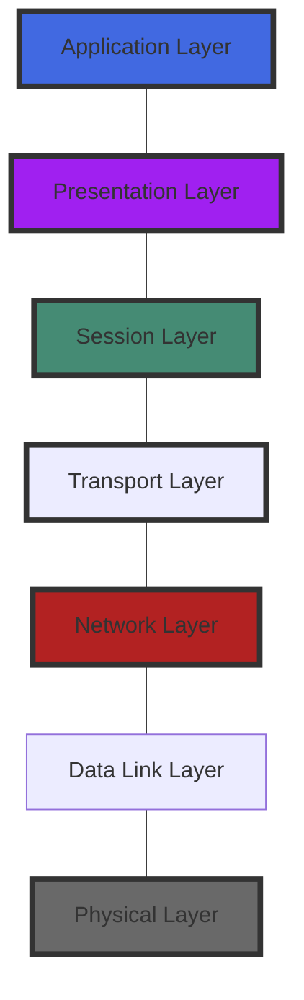

> Refernce link: https://www.geeksforgeeks.org/layers-of-osi-model/?ref=lbp

# Fundamentals

## Layers of OSI Model

### 1. Physical Layer

物理层是OSI参考模型的最低层。它负责设备之间的实际物理连接。物理层包含Bit形式的信息，负责将单个Bit从一个节点传输到下一个节点。当接收数据时，该层将获得所收到的信号，并将其转换为0和1，然后将其发送到数据链路层，后者把帧重新组合起来。

物理层的功能如下： 

- **Bit位同步**。物理层通过提供一个时钟来实现Bit位的同步，该时钟控制发送方和接收方，从而在比特层面提供同步。
- **Bit率控制**。物理层还定义了传输速率，即每秒发送的比特数。
- **物理拓扑结构**。物理层规定了不同的、设备/节点在网络中的排列方式，即总线、星形或网状拓扑结构。
- **传输模式**。物理层也定义了数据在两个连接设备之间流动的方式。各种可能的传输模式是单工、半双工和全双工。

### 2. Data Link Layer

数据链路层负责端到端的信息传递。当一个数据包到达网络时，DLL的责任是利用其MAC地址将其传送到主机。

数据链路层分为两个子层。

- 逻辑链路控制（LLC）
- 媒体访问控制（MAC）

从网络层收到的数据包根据NIC（网络接口卡）的帧大小被进一步划分成帧。DLL还需要将发送方和接收方的MAC地址封装在报头中。

接收方的MAC地址通过在线路上放置ARP（地址解析协议）请求来获得，解析时询问 "谁有这个IP地址？"，目的主机将回复其MAC地址。

数据链路层的功能是：

- **组帧**。组帧是数据链路层的一个功能。它为发送方提供了一种方法来传输一组对接收方有意义的比特。这可以通过在帧的开始和结束处附加特殊的比特来实现。
- **物理寻址**。在创建帧后，数据链路层在每个帧的头中添加发送方和/或接收方的物理地址（MAC地址）。
- **错误控制**。数据链路层提供错误控制的机制，它检测并重传损坏或丢失的帧。
- **流量控制**。双方的数据速率必须是恒定的，否则数据可能会被破坏，因此，流量控制协调了在收到确认之前可以发送的数据量。
- **访问控制**。当一个通信信道被多个设备共享时，数据链路层的MAC子层有助于确定哪个设备在给定时间内对该信道拥有控制权。

### 3. Network Layer

网络层的工作是将数据从一台主机传输到位于不同网络的另一台主机。它还负责数据包的路由，即从可用的路由数量中选择最短的路径来传输数据包。发送方和接收方的IP地址由网络层放在头中。

网络层的功能：

- **路由**。网络层协议决定哪条路由适合从源头到目的地。网络层的这一功能被称为路由。
- **逻辑寻址**。为了独特地识别网络中的每个设备，网络层定义了一个寻址方案。发送方和接收方的IP地址由网络层放在报头中。这样的地址可以唯一地、普遍地区分每个设备。

### 4. Transport Layer

传输层向应用层提供服务，并从网络层获取服务。传输层中的数据被称为分段。它负责完整信息的端到端交付。传输层还提供数据传输成功的确认，并在发现错误时重新传输数据。

在发送方一侧。传输层从上层接收格式化的数据，执行分段，并实现流量和错误控制，以确保正确的数据传输。它还在其头中添加源和目的端口号，并将分段数据转发到网络层。

在接收方一侧。传输层从其标题中读取端口号，并将其收到的数据转发给相应的应用程序。它还对分段的数据进行排序和重新组合。

传输层的功能如下:

- **分段和重新组装**。该层接受来自（会话）层的消息，并将消息分解成较小的单元。产生的每个分段都有一个与之相关的头。目的站的传输层重新组装消息。
- **服务点寻址**。为了将消息传递给正确的进程，传输层的头包括一种叫做服务点地址或端口地址的地址。因此，通过指定这个地址，传输层确保消息被传递到正确的进程。

传输层提供的服务：

- **面向连接的服务**
- **无连接的服务**

### 5. Session Layer

该层负责建立连接、维护会话、认证，并确保安全。

会话层的功能： 

- **会话建立、维护和终止**。该层允许两个进程建立、使用和终止一个连接。
- **同步**。该层允许一个进程在数据中添加检查点，这些检查点被认为是同步点。这些同步点有助于识别错误，从而使数据被正确地重新同步，消息的两端不会被过早地切断，避免了数据丢失。
- **对话控制器**。会话层允许两个系统以半双工或全双工的方式开始相互通信。

### 6. Presentation Layer

展示层也被称为翻译层。来自应用层的数据在这里被提取出来，并按照要求的格式进行处理，以便在网络上传输。

展现层的功能是。

- **翻译**。例如，ASCII到EBCDIC。
- **加密/解密**。数据加密将数据翻译成另一种形式或代码。
- **压缩**。减少需要在网络上传输的比特数量。

### 7. Application Layer

在OSI参考模型堆栈的最顶端，应用层是由网络应用实现的。这些应用产生的数据，必须通过网络传输。这一层也是应用服务访问网络和向用户显示所收到信息的窗口。

应用层的功能：

- 网络虚拟终端
- FTAM-文件传输访问和管理
- 邮件服务
- 目录服务

## TCP/IP模型

Layers in TCP/IP | OSI Model | Protocols | Protocol Data-unit | Addressing
--- | --- | --- | --- | ---
Application | Application | HTTP, HTTPS, SSH, NTP | Messages | N/A
Transport | Presentation  ---  Session  ---  Transport | TCP, UDP | Segments/Datagrams | Ports
Network/Internet | Network | IP, ICMP, ARP | Packets | IP Address
Data-link | Data-link | PPP, IEEE 802.2 | Frames | MAC Address
Physical | Physical | N/A |Bits/Signals |N/A