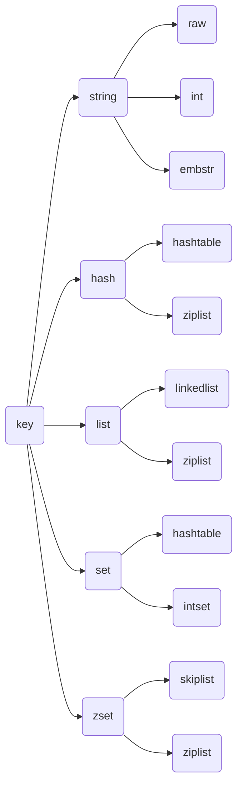

> 以下内容引用自付磊、张益军《Redis开发与运维》

# 第1章 初识Redis

## 1.1 Redis简介

Redis是一个速度非常快的非关系数据库。

## 1.2 Redis特性

**1. 速度快**

Redis速度快的原因：

*   所有数据都是存放在内存中的；
*   是用实现的程序“距离”操作系统相对更近，执行速度相对更快的C语言实现的；
*   使用了单线程架构，预防了多线程可能产生的竞争问题；
*   Redis源代码精打细磨，集性能和优雅于一身。

**2. 基于键值对的数据结构服务器**

与很多键值对数据库不同的是，Redis中的值不仅可以是字符串，还可以是具体的数据结构。主要提供5种数据结构：字符串、哈希、列表、集合、有序集合。

**3. 丰富的功能**

*   键过期功能，可用来实现缓存；
*   发布订阅功能，可用来实现消息系统；
*   Lua脚本功能，可利用Lua创造出新的Redis命令；
*   简单的事务功能，能在一定程度上保证事务特性；
*   流水线（Pipeline）功能，使客户端能将一批命令一次性传到Redis，减少了网络的开销。

**4. 简单稳定**

早期版本源码只有2万行左右，单线程模型，也使得客户端开发变得简单，且Redis不依赖操作系统的类库。

**5. 客户端语言多**

Redis提供了简单的TCP通信协议，很多编程语言可以很方便地接入到Redis，且由于Redis收到社区和各大公司地广泛认可，所以支持Redis的客户端语言也非常多，如Java、PHP、Python、C、C++、Node js等。

**6. 持久化**

一般来说，将数据放在内存中是最不安全的，一旦发生断点或者及其故障，重要的数据可能就会丢失，因此redis提供了两种持久化方式：RDB和AOF。

**7. 主从复制**

Redis提供了复制功能，实现了多个相同数据的Redis副本，复制功能是分布式Redis的基础。

**8. 高可用和分布式**

Redis从2.8版本正式提供了高可用实现Redis Sentinel，它能够保证Redis节点的故障发现和故障自动转移。Redis从3.0版本正式提供了分布式实现Redis Cluster，它是Redis真正的分布式实现，提供了高可用、读写和容量的扩展性。

# 1.3 Redis使用场景

*   **缓存**，缓存机制几乎在所有的大型网站都有使用，合理地使用缓存不仅可以加快数据的访问速度，而且能够有效地降低后端数据源的压力。
*   **排行榜系统**，Redis提供了列表和有序集合数据结构，合理地使用这些数据结构可以很方便地构建各种排行榜系统。
*   **计数器应用**，Redis天然支持计数功能而且计数的性能也非常好，可以说是计数器系统的重要选择。
*   **社交网络**
*   **消息队列系统**，Redis提供了发布订阅功能和阻塞队列功能。

## 1.5 正确安装并启动Redis

### 1.5.2  配置、启动、操作、关闭Redis

**Redis可执行文件**：

*   *redis-server*，启动Redis
*   *redis-cli*，Redis命令行客户端
*   *redis-benchmark*，Redis基准测试工具
*   *redis-check-aof*，Redis AOF持久化文件检测和修复工具
*   *redis-check-dump*，Redis RDB持久化文件检测和修复工具
*   *redis-sentinel*，启动Redis Sentinel

**1. 启动Redis**

三种启动方式：

*   默认配置

`redis-server`命令不带任何参数即为默认配置。

*   运行配置

`redis-server [--配置键1] [配置值1]...`

*   配置文件启动

`redis-server [配置文件（*.conf）]`

Redis有60多种配置，基础配置有：

- `port`:端口
- `logfile`：日志文件
- `dir`：Redis工作目录
- `daemonize`：是否以守护进程的方式启动Redis

**2. Redis命令行客户端**

可以使用两种方式连接Redis服务器：

- **交互式方式**，通过`redis-cli -h {host} -p {port}`方式连接到Redis服务。
- **命令方式**，通过`redis-cli -h {host} -p {port} {command}`

**3. 停止Redis服务**


```
redis-cli shutdown [nosave|save]
```

> nosave/save代表是否在关闭Redis前，生成持久化文件。

还可以通过在操作系统停止进程的方式关闭掉Redis。

# 第2章 API的使用和理解

## 2.1 预备知识

### 2.1.1 全局命令

**1. 查看所有键**


```
keys *
```

**2. 键总数**

```
dbsize
```

**3. 检查键是否存在**

```
exists key
```

**4. 删除键**

```
del key [key ...]
```

**5. 键过期**

```
expire key seconds
```

`ttl`命令会返回键的剩余过期时间，它有3种返回值：

- 大于等于0的整数：键剩余的过期时间
- -1：键没设置过期时间
- -2：键不存在

**6. 键的数据结构类型**

```
type key
```

### 2.2.1 数据结构和内部编码

每种数据结构都有自己底层的内部编码实现，而且是多种实现，这样Redis会在合适的场景选择合适的内部编码。如图所示：



可以通过`object encoding`命令查询内部编码：

```
object encoding key
```

Redis这样设计的好处：

- **可以改进内部编码**，而对外的数据结构和命令没有影响。如Redis 3.2的quicklist，结合了ziplist和linkedlist两者的优势。
- **多种内部编码实现可以在不同场景下发挥各自的优势**。如ziplist比较节省内存，但在列表元素较多时性能会有所下降，这时Redis会根据配置选项将列表类型的内部实现转换为linkedlist。

### 2.1.3 单线程架构

Redis使用了单线程架构和I/O多路复用模型来实现高性能的内存数据库服务。

**1. 单线程模型**

Redis的命令从客户端到达服务端不会立刻被执行，所有命令都会进入一个队列种，然后逐个被执行。对于同时发送到Redis的命令的执行顺序是不确定的，但可以确定不会有两条命令被同时执行。

**2. 为什么单线程还能这么快**

- **纯内存访问**。Redis将所有数据放在内存中。
- **非阻塞I/O**。Redis使用epoll作为I/O多路复用的实现，再加上Redis自身的事件处理模型将epoll的连接、读写、关闭都转换为事件，不在网络I/O上浪费过多的时间。如图所示：


- **单线程避免了线程切换和竞态产生的消耗**。

## 2.2 字符串

字符串类型是Redis最基本的数据结构。首先键都是字符串类型，而且其他几种数据结构都是在字符串的基础上构建的。字符串类型的值可以是字符串（简单的字符串、复杂的字符串（如JSON、XML））、数字（整数、浮点数），甚至是二进制（图片、音频、视频），但是值最大不能超过512MB。

> 《Redis设计与实现》：Redis没有直接使用C语言传统的字符串（以空字符结尾的字符数组）表示，而是构建了一种名为简单动态字符串（Simple Dynamic String, SDS）的抽象类型，并将SDS用作Redis的默认字符串表示。
> 在Redis里面，C字符串自会作为字符串字面量用在一些无须对字符串值进行修改的地方，比如打印日志。


### 2.2.1 命令

**1. 常用命令**

(1). 设置值

```
SET key value [NX|XX] [GET] [EX seconds|PX milliseconds|EXAT unix-time-seconds|PXAT unix-time-milliseconds|KEEPTTL]
```

参数选项：

- EX seconds：为键设置秒级过期时间。
- PX milliseconds：为键设置毫秒级过期时间。
- NX：键必须不存在，才可以设置成功。
- XX：键必须存在，才可以设置成功。

Redis还提供了`SETEX`和`SETNX`两个命令：

```
SETNX key value
SETEX key seconds value
```

批量设置值：

```
MSET key value [key value ...]
```

（2）获取值

```
GET key
```

批量获取值：

```
MGET key [key ...]
```

（3）计数

```
INCR key
```

`INCR`命令用于对值做自增操作，返回结果分三种情况：

- 值不是整数，返回错误。
- 值是整数，返回自增后的结果。
- 值不存在，按照值为0自增，返回结果为1。

Redis还提供了`DECR`、`INCRBY`、`DECRBY`、`INCRBYFLOAT`。

**2. 不常用命令**

（1）追加值

```
APPEND key value
```

`APPEND`可以向字符串尾部追加值。

（2）字符串长度

```
STRLEN key
```

（3）设置并返回原值

```
GETSET key value
```

`GETSET`和`SET`一样会设置值，但不同的是它会同时返回键原本的值。

（4）设置指定位置的字符

```
SETRANGE key offset value
```

（5）获取部分字符串

```
GETRANGE key start end
```

### 2.2.2 内部编码

字符串类型的内部编码有三种：

- int：8个字节的长整型。
- embstr：小于等于39个字节的长字符串。
- raw：大于39个字节的字符串。

Redis会根据当前值的类型和长度决定使用哪种内部编码实现。

### 2.2.3 典型使用场景

**1. 缓存功能**

由于Redis具有支撑高并发的特性，所以缓存通常能起到加速读写和降低后端压力的作用。

与MySQL等关系型数据库不同的是，Redis没有命名空间，而且也没有对键名有强制要求（除了不能使用一些特殊字符）。但设计合理的键名，有利于防止键冲突，提高项目的可维护性。比较推荐使用“业务名：对象名：ID：属性”作为键名。

**2. 计数**

使用Redis可以实现快速计数、查询缓存的功能，同时数据可以异步落地到其他数据源。

**3. 共享Session**

一个分布式Web服务将用户的Session信息（例如用户登录信息）保存在各自服务器中，这样会造成一个问题，处于负载均衡的考虑，分布式服务会将用户的访问均衡到不同服务器上，用户刷新一次访问可能会发现需要重新登录，这个问题是用户无法容忍的。

为了解决这个问题，可以使用Redis将用户的Session进行集中管理，在这种模式下只要保证Redis是高可用和扩展性的，每次用户更新或者查询登录信息都直接从Redis中集中获取。

# 慢查询分析

一条客户端命令的生命周期：

1.  发送命令
2.  命令排队
3.  命令执行
4.  返回结果

设置慢查询参数

- slowlog-log-slower-than 微秒数

- slowlog-max-len 长度
命令：
- slowlog get [n] //获取慢查询日志列表或指定n对应的列表项
- slowlog len //获取慢查询日志列表长度
- slowlog reset //重置慢查询日志

# Redis Shell

## redis-cli

### -r

-r（repeat）表示将命令多次执行

### -i

-i（interval）选项代表每隔几秒执行依次命令，可以和-r参数搭配使用。

### -x

-x选项代表从标准输入读取数据作为redis-cli的最后一个参数，如：
echo "world" | redis-cli -x set hello

### -c

连接redis cluster节点时需要的

### -a

登录密码选项

### --scan和--pattern

扫描指定模式的键

### --slave

把当前客户端模拟成当前redis节点的从节点

## redis-server

## redis-benchmark

- -c（clients）代表客户端的并发数量（默认50）
- -n（num）代表客户端请求总量（默认是100000）
- -q选项仅显示redis-benchmark的requests per second信息
- -r插入指定数量的随机的键

# Pipeline

redis-cli --pipe

# 事务与Lua

为了保证多条命令组合的原子性，Redis提供了简单的事务功能和集成的Lua脚本来解决这个问题。
- multi
命令组合exec或discard

## Redis事务对于错误的命令的处理机制：

### 命令错误

命令错误会造成整个事务无法执行

### 运行时错误

出现运行时错误时，错误出现前的命令仍旧执行成功，无法回滚。

## WATCH、UNWATCH、DISCARD命令

*   Redis的WATCH、MULTI和EXEC命令只是一个乐观锁--只会在数据被其他客户端抢先修改了的情况下，通知加锁的客户端撤销对数据的修改，而不会真正地把数据锁住。
*   UNWATCH命令可以在WATCH命令执行之后，MULTI命令执行之前对连接进行重置。
*   DISCARD命令可以在MULTI命令执行之后、EXEC命令执行之前对连接进行重置。

# Lua用法

Lua脚本功能的优点：

*   Lua脚本在Redis中是原子执行的；
*   可利用Lua脚本创造出自己定制的命令；
*   Lua脚本可以将多条命令一次性打包。

# Bitmaps

Bitmaps本身不是一种数据结构，实际上他就是字符串，但支持对字符串的位进行操作；Bitmaps单独提供了一套命令，所以在Redis中使用Bitmaps和使用字符串的方法不太相同。

# 发布订阅

# GEO

# 客户端

# 持久化

Redis支持RDB和AOF两种持久化机制，持久化功能有效地避免因进程退出而造成地数据丢失问题，下次重启时利用之前持久化的文件即可实现数据恢复。

## RDB

RDB把当前进程数据生成快照保存到硬盘的过程，触法手段分为手动触发和自动触发。

*   save命令:阻塞当前Redis服务器，直到RDB过程完成为止。
*   bgsave命令：Redis进程执行fork操作创建子进程，RDB持久化过程由子进程完成，完成后自动结束。

### RDB的优点

*   *   RDB是紧凑压缩的二进制文件，代表Redis在某个时间点上的数据快照。
    *   Redis加载RDB恢复数据远远快于AOF的方式。

### RDB的缺点

*   *   RDB方式没法做到实时/秒级持久化。
    *   RDB文件使用特定二进制格式保存，可能存在版本不兼容问题。

# AOF

AOF（append only file）持久化：以独立日志的方式记录每次写命令，重启时再重新执行AOF文件中的命令达到恢复数据的目的。
AOF的主要作用是解决数据持久化的实时性，目前已是Redis持久化的主流方式。

## 开启AOF功能

设置配置：appendonly yes

## AOF工作流程

1.  命令写入（append）
2.  文件同步（sync）
3.  文件重写（rewrite）
4.  重启加载（load）

## AOF缓冲区同步文件策略

*   always：每次写入都要同步AOF文件，在一般SATA硬盘上，Redis只能支持约几百TPS写入，与Redis高性能背道而驰，不建议配置；
*   no：不做fsync操作，同步硬盘操作由操作系统负责。由于同步周期不可控，虽提升了性能，但数据安全性无法保证。
*   everysec：每次写入，fsync操作由专门线程每秒调用一次。建议配置，兼顾了性能和安全性。

# 复制

## 配置方式

*   在配置文件中加入slaveof {masterHost} {masterPort}
*   在redis-server命令后加入--slaveof {masterHost} {masterPort}
*   直接使用命令slaveOf {masterHost} {masterPort}

## 节点复制信息

info replication

## 断开主从关系配置

执行slaveof no one命令

## 拓扑

*   一主一从结构

最简单的复制拓扑结构，用于主节点出现宕机时从节点提供故障转移支持。当应用写命令并发量较高且需要持久化时，可只在从节点上开启AOF，这样既保证数据安全性同时避免了对主节点的性能ganrao。

*   一主多从

使得应用端可以利用多个从节点实现读写分离，对于读占比较大的场景，可以把都命令发送到从节点上执行分担主节点压力。

*   树状主从结构

通过引入复制中间层，可以有效降低主节点负载和需要传送给从节点的数据量。

## 数据同步

Redis在2.8及以上版本使用psync命令完成主从数据同步，同步过程分为：全量复制（一般用于初次复制场景）和部分复制（用于网络闪断等原因造成的数据丢失场景）。

## 主从配置不一致

对于有些配置主从之间可以不一致，但对于内存相关的配置必须要一致。

# Redis Sentinel

当节点出现故障时，Redis Sentinel能自动完成故障发现和故障转移，并通知应用方，从而实现真正的高可用。
Redis Sentinel是一个分布式架构，其中包含若干个Sentinel节点与Redis数据节点，每个Sentinel节点会对数据节点和其余Sentinel节点进行监控，当发现节点不可用时，会对节点做下线标识。若被标识的时主节点，Sentinel节点会和其余Sentinel节点协商选举某Sentinel节点来完成自动故障转移工作，且会将变化实时通知给Redis应用方。

## 启动Sentinel节点

*   使用redis-sentinel命令
*   使用redis-server --sentinel

## 配置

*   sentinel monitor <主节点别名> <主节点ip> <主节点端口> <判主节点不可达所需票数>
*   sentinel down-after-milliseconds <主节点别名> <时间>
*   sentinel parallel-syncs <主节点别名> <数量>
*   sentinel failover-timeout <主节点别名> <时间>

# API

sentinel masters //主节点列表
sentinel master <主节点名称> //给定名称对应主节点的信息
sentinel slaves <主节点名称> //给定主节点的从节点信息列表
sentinel sentinels <主节点名称> //给定主节点的Sentinel节点信息
sentinel get-master-addr-by-name <主节点名称> //获取节点ip和端口号地址
sentinel reset <pattern> //对匹配模式的主节点进行重置
sentinel failover <主节点名称> //对主节点进行强制故障转移
sentinel remove <主节点名称> //对主节点取消监控

## Sentinel客户端

# Cluster

Redis Cluster是Redis的分布式解决方案，在3.0版本正式推出，在此之前，Redis分布式方案一般有两种：

*   客户端分区方案，使得分区逻辑可控，但需要自己处理数据路由、高可用、故障转移等问题。
*   代理方案，简化了客户端分布式逻辑和升级维护遍历，但加重了架构部署的复杂度和性能消耗。

## 数据分布

分布式数据库：把数据集划分到多个节点上，每个节点负责整体数据的一个子集。
数据分区规则：哈希分区、顺序分区。

## 哈希分区规则

*   节点取余分区

使用Redis的键或用户ID表示的key和节点数量N根据公式hash(key)%N计算出的哈希值用来决定数据映射到哪一个节点上。当节点数量发生变化时，数据节点映射关系需要重新计算，会导致数据的重新迁移。突出优点是简单性。一般采用预分区的方式，保证可制成未来一段时间的数据量，扩容时采用翻倍扩容的方式，避免数据映射全部被打乱导致全量迁移。

*   一致性哈希分区

实现思想是为系统中每个节点分配一个token，这些token构成一个哈希环。数据读写执行节点查找操作时，先根据key计算hash值，然后顺时针找到第一个大于等于该哈希值的token节点。

*   虚拟槽分区

虚拟槽分区巧妙地使用哈希空间，使用分散度良好的哈希函数把所有数据映射到一个固定范围的整数集合中，整数定义为槽。这个范围一般远远大于节点数，比如Redis Cluster的草范围是0-16383。槽是集群内数据管理和迁移的基本单位。大范围槽的主要目的是方便数据拆分和集群扩展。每个节点会负责一定数量的槽。
特点：

*   *   解耦数据和节点之间的关系，简化了节点扩容和收缩难度；
    *   节点自身维护槽的映射关系，无需客户端或者代理服务器维护槽分区元数据。
    *   支持节点、槽、键之间的映射查询，用于数据路由、在线伸缩等场景。

### 集群功能限制

*   key批量操作支持有限。如mget、mset，只支持具有相同slot值得key执行操作。
*   key事务支持有限。只支持多key在同一节点上的事务操作。
*   key作为数据分区的最小粒度，因此不能将一个大的键值对象如hash、list等映射到不同节点。
*   不支持多数据库空间。
*   复制结构只支持一层，从节点只能复制主节点，不支持嵌套树状复制结构。

### 搭建集群

*   准备节点

集群的节点数量至少要6个才能保证组成完整高可用的集群。节点相关配置类似如下所示：

# 开启集群模式
cluster-enabled yes
# 节点超时时间，单位为秒
cluster-node-timeout 15000
# 集群内部配置文件
cluster-config-file "node.conf"

集群模式的Redis除原有配置文件之外又加了一份集群配置文件，当集群内节点信息发生变化时，节点会自动保存集群状态到配置文件中。Redis自动维护集群配置文件。

*   节点握手

节点握手是指一批运行在集群模式下的节点通过Gossip协议彼此通信。由客户端发出命令cluster meet {ip} {port}来完成。
节点握手之后集群还不能正常工作，此时集群处于下线状态，所有的数据读写都被禁止，直至槽位被分配。

*   分配槽

Redis集群会把所有的数据映射到16384个槽中。每个key会映射为一个固定的槽，只有当节点分配了槽，才能响应与这些槽关联的命令。通过redis-cli --cluster create命令分配槽。

redis-cli --cluster create <节点IP>:<节点端口> ... <节点IP>:<节点端口>

*   为集群中的主节点设置从节点

## 扩容集群

*   准备新节点
*   加入集群
*   迁移槽和数据

## 收缩集群

*   下线迁移槽
*   忘记节点

## 请求路由

### 请求重定向

在集群模式下，Redis接收任何键相关命令时首先计算键对应的槽，再根据槽找出所对应的节点。若节点是自身，则处理命令；否则恢复MOVED重定向宠物，通知客户端请求正确的节点。
使用redis-cli加入-c参数支持自动重定向，简化手动发起重定向操作。

# 缓存

## 缓存的收益

*   加速读写

因为缓存通常都是全内存的，而存储层通常读写性能不够强悍，通过缓存的使用可以有效地加速读写，优化用户体验。

*   降低后端负载

帮助后端减少访问量和复杂计算（例如很复杂的SQL语句），在很大程度降低了后端的负载。

## 缓存的成本

*   数据不一致性

缓存层和存储层的数据存在着一定时间窗口的不一致性。

*   代码维护成本

加入缓存后，需要同时处理缓存层和存储层的逻辑，增大了开发者维护的成本。

*   运维成本

## 缓存使用场景

*   开销大的复杂计算
*   加速请求响应

## 缓存更新策略

### LRU/LFU/FIFO算法剔除

剔除算法通常用于缓存使用量超过了预设的最大值的时候，如何对现有数据进行剔除。

*   一致性：要清理哪些数据是由具体算法决定，开发人员只能决定使用那种算法，所以数据的一致性是最差的。
*   维护成本：算法不需要开发人员自己来实现，通常只需配置最大maxmemory和对应策略即可，维护成本很低。

### 超时剔除

超时剔除通过给缓存数据设置过期时间，让其在过期时间后自动删除。

*   一致性：一段时间窗口内存在一致性问题。
*   维护成本：维护成本不是很高，只需设置expire过期时间即可。

### 主动更新

应用方对于数据的一致性要求高，需要在真实数据更新后，立即更新缓存数据。

*   一致性：

一致性最高，但如果主动更新发生了问题，那么这条数据很可能很长时间不会更新，所以建议结合剔除一起使用。

*   维护成本：

维护成本较高。

## 缓存粒度控制

缓存全部属性还是只缓存部分属性，需要综合数据通用性、空间占用比、代码可维护性三点进行取舍。

*   通用性

缓存全部属性通用性更高。

*   空间占用

缓存部分属性空间占用更少，还会造成内存的浪费、每次传输网络流量大，极端情况下可能阻塞网络、序列化和反序列化的CPU开销更大。

*   代码维护

缓存全部属性更易维护。

## 穿透优化

缓存穿透是指查询一个根本不存在的数据，缓存层和存储层都不会命中。缓存穿透将导致不存在的数据每次请求丢要到存储层去查询，去去了缓存保护后端存储的意义。

### 解决缓存穿透手段

*   缓存空结果

缺点：1.缓存空值，意味着缓存层存了更多的键，需要更多的内存空间，可针对这类数据设置一个较短的过期时间，让其自动剔除；2.缓存层和存储层的数据会用一段时间窗口的不一致。

*   布隆过滤器

在访问缓存层和存储层之前，将存在的key用布隆过滤器提前保存起来，做一层拦截。这种方式适用于数据命中不高、三个月还有相对固定、实时性低的应用场景，代码维护较为复杂，但是缓存空间占用少。

## 无底洞优化

键值数据库由于通常采用哈希函数将key映射到各个节点上，造成key的分布与业务无关，但是由于数据量和访问量的持续增长，造成需要添加大量节点做水平扩容，导致简直分布到更多的节点上，批量操作通常需要从不同的节点上获取，相比于单机批量操作只设计一次网络操作，分布式批量操作会涉及多次网络时间。

### 优化方式

命令本身的优化；
减少网络通信次数；
降低接入成本，如客户端使用长连/连接池、NIO等。

## 雪崩优化

缓存雪崩指由于缓存层由于某些原因不能提供服务导致所有的请求都会到达存储层，存储层的调用量激增的情况。

### 优化方案：

*   保证缓存层服务的高可用；
*   为后端限流并降级；
*   数据预热。

## 热点key重建优化

# 构建应用程序组件

## 分布式锁

分布式锁也有类似的“先获取锁，再执行操作，最后释放锁”动作，但这种锁既不是给同一台进程中的多个线程使用，也不是给同一台机器上的多个进程使用，而是给不同机器上的不同Redis客户端进行获取和释放的。
Redis使用WATCH命令来代替对数据进行加锁，因为WATCH命令只会在数据被其他客户端抢先修改了的情况下通知执行了这个命令的客户端，而不会阻止其他客户端对数据进行修改，所以这个命令被称为乐观锁。
不使用操作系统级别、编程语言级别和其他各式各样的锁，而是构建Redis锁的一个原因是为了对Redis存储的数据进行排他性访问，客户端需要访问一个所，这个锁必须定义在一个可以让所有客户端都看得见的范围之内，而这个范围就是Redis本身；另一个原因是Redis虽提供了SETNX命令来完成基本的加锁功能，但他的功能并不完整，并不具备分布式锁常见的一些高级特性。

### 简易锁

大部分使用Redis实现的锁只是基本上正确，它们发生故障的时间和方式通常难以预料。一些原因如下：

*   持有锁的进程因操作时间过长而导致锁被自动释放，但进程并不知晓，甚至还可能释放掉了其他进程持有的锁；
*   持有锁并打算长时操作的进程已崩溃，其余线程想获取锁不知道哪个进程持有锁，且无法检测持有锁进程已崩溃，只能白白地等待锁被释放；
*   在某进程持有锁过期后，其余进程同时尝试获取锁，且都获取了锁；
*   情况一和情况三同时出现，致多进程获得了锁，而各进程都以为自己是唯一一个获得锁的进程。

### 细粒度锁

### 带有超时限制的锁

## 计数信号量

计数信号量是一种锁，它可以让用户限制一项资源最多能够同时被多少个进程访问，通常用于限定能够同时使用的资源数量。互斥锁可看作为只能被一个进程同时访问的特殊的信号量。